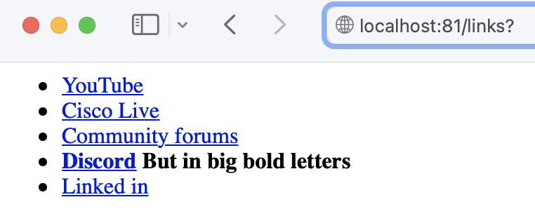

<!-- Google tag (gtag.js) -->
<script async src="https://www.googletagmanager.com/gtag/js?id=G-XKHR6PXZ9V"></script>
<script>
  window.dataLayer = window.dataLayer || [];
  function gtag(){dataLayer.push(arguments);}
  gtag('js', new Date());

  gtag('config', 'G-XKHR6PXZ9V');
</script>

# Contents
- [Technology covered](#technology-covered-)
- [The story pt1](#the-story-pt1-)
- [Web back end baseline](#web-back-end-baseline-)

### **[The current locally run web application is here](https://www.github.com/sammybibs/DNAC_API_Query/)**

# Technology covered <a name="technology-covered"></a>
* January 01 2023
* Python
  * Flask
  * jinja2
  * lists
  * dictionaries
  * if/else
  * HTML

<br><br>

# The story pt1 <a name="the-story-pt1"></a>

At this stage of the development cycle we will investigate the flask container and develop a framework to front end our project.

# Web back end baseline <a name="web-back-end-baseline"></a>
First lets pull together a base shell to work from, this is called ```Hello_flask.py```
```python
 ###This import needed to parse templates
from flask import render_template

 ###Add support for POST calls
from flask import request
from flask import Flask, redirect, url_for, request

 ###Base import
from flask import Flask

 ###The sets the flask app up
app = Flask(__name__)

 ###Sets up the flask server if this code is called directly
if __name__ == '__main__':
    app.run(host='0.0.0.0', port=81)
```

<br><br>

Now if we run this code not a lot will happen, as there is no page to render when we browse to the url:

```python
 * Running on all addresses (0.0.0.0)
 * Running on http://127.0.0.1:81
 * Running on http://192.168.0.81:81
Press CTRL+C to quit
127.0.0.1 - - [11/Jan/2023 14:45:53] "GET / HTTP/1.1" 404 -
```

<br><br>

So we need a page to present at the route "/" page, like an index or readme.

```python
 ###Add some header variables to demo thier usage
dev = 'Sam Bibby'
updated = 'Jan 11th 2023'
purpose = 'learning'

 ###This import & variable used to get todays date
from datetime import datetime
date = datetime.now().strftime('%Y/%m/%d')

 ###The route() decorator, @app.route(), binds a URL to a function.
 ###The URL in thei case is the root of the page '/'
@app.route('/',methods = ['POST', 'GET'])
def index():
   if request.method == 'GET':
      print('jolly')
      return render_template('first_page.html', data=[dev,updated,purpose], timestamp=date)
```

<br><br>

We also need to create a ```first_page.html``` file, this should be saved in the /templates folder where the source code resides, as thats where flask will look.

Note that within the html we can use [Jinja2](https://jinja.palletsprojects.com/en/3.1.x/) for data manipulation. Below we create the file ```first_page.html``` as per the route decorator function.

```html
<html>
   <head>
      <h3>Welcome to the Web query engine </h3>
  </head>
   <body>
         Current values set are as follows: <br>
         Developer = {{ data[0] }} <br>
         Updated = {{ data[1] }} <br>
         Purpose = {{ data[2] }} <br><br>

         Todays date is {{ timestamp }} <br><br>
   </body>
</html>
```

<br><br>

Now when we run our code we get the web page presented:

I can see we made a GET request below to "/"
```python
 * Running on all addresses (0.0.0.0)
 * Running on http://127.0.0.1:81
 * Running on http://192.168.0.81:81
Press CTRL+C to quit
127.0.0.1 - - [11/Jan/2023 14:49:17] "GET / HTTP/1.1" 200 -
```

<br><br>

This calls the route decorator for the "/" path and passes the variables in a ```list``` to the template (notice here you can use GET or POST actions to dictate the returned functionality)
```python
@app.route('/',methods = ['POST', 'GET'])
def index():
   if request.method == 'GET':
      return render_template('first_page.html', data=[dev,updated,purpose], timestamp=date)
```

<br><br>

The template renders with the variables based on the called indexes, and we see in the front end as:


We can now add to this via creating interactive objects on the home page that launch other pages, for example a button here to call a new url, that calls a route decorator and renders a new page.

Below we update the file ```first_page.html``` file with a button object that calls the webpage /links
```html
<html>
   <head>
      <h3>Welcome to the Web query engine </h3>
  </head>
   <body>
         Current values set are as follows: <br>
         Developer = {{ data[0] }} <br>
         Updated = {{ data[1] }} <br>
         Purpose = {{ data[2] }} <br><br>

         Todays date is {{ timestamp }} <br><br>

         <form action = "http://localhost:81/links" method = "get">
         <button type="submit">Check My Bios</button>
         ::: See a list of really cool links
         </form><br>
   </body>
</html>
```


<br><br>

We add a new route to our ```Hello_flask.py``` file, this will pass a dictionary ```link_me``` that the jinja2 engine can parse when rendering the ```second_page.html``` file.
```python
 ###The route() decorator, @app.route(), binds a URL to a function.
 ###Where The decorator can renders a template with static variables
@app.route('/links')
def links():
   link_me = {"YouTube":"https://www.youtube.com/channel/UCFsz8jHR4Al-BqbfzFkGLPg",
            "Cisco Live":"https://www.ciscolive.com/on-demand/on-demand-library.html?search=bibby#/",
            "Community forums":"https://community.cisco.com/t5/user/viewprofilepage/user-id/194314)",
            "Discord":"https://discordapp.com/users/933769884050018364",
            "Linked in":"https://www.linkedin.com/in/samuel-bibby-22b03751/)"}
   return render_template('second_page.html', hyperlinks=link_me)
```

<br><br>

Then in the /templates folder we create the template thats to be rendered ```second_page.html```. This tempate uses jinja2 to render the items in the passed dictionary, where shown also has one ```if``` statement to highlight the key ```Discord``` in bold.
> Note: had to write the for loop in [```liquid```](https://shopify.dev/api/liquid/tags/iteration-tags#for) format to get it past the git parser checks, else we could unpack them as one line per ```(k,v in hyperlinks.items())```

```html
<html>
   <head>
      <title>{{ title }}</title>
   </head>
   <body>
      <ul>
         
            
            <li><b> <a href="{{ hyperlinks[k] }}">{{ k }}</a> But in big bold letters </b></li>
            
            <li><a href="{{ hyperlinks[k] }}">{{ k }}</a> </li>
            
         
      </ul>
   </body>
</html>
```

And front the front end when we click the ```Check My Bios``` button, we are cross launched to the new page thats rendered right before our eyes!:


So Viola, this is a basic flask app that we can use to present data in a nicer fashion than asking then to run some CLI.

Next we will look at leveraging API's towards DNAC, then how we can tie them together with flask for a nicer front end.
