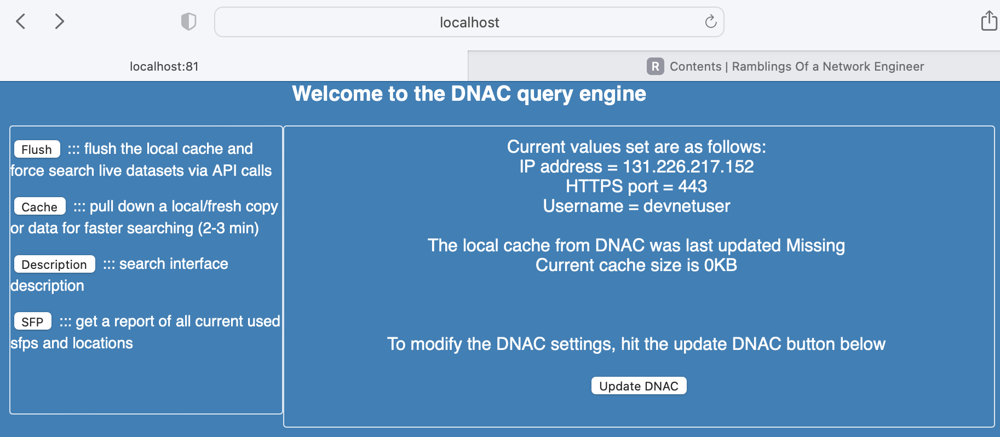

# Contents
- [Technology covered](#technology-covered-)
- [The story](#the-story-)
- [Arranging the folder structure](#arranging-the-folder-structure-)
- [Setup the DNAC python files](#setup-the-dnac-python-files-)
- [Setup the flask routes and web pages](#setup-the-flask-routes-and-web-pages-)
- [Finalizing the code](#finalizing-the-code-)

### **[The current locally run web application is here](https://www.github.com/sammybibs/DNAC_API_Query/)**

# Technology covered <a name="technology-covered"></a>
* January 03 2023
* Python
  * Flask
  * jinja2


<br><br>

# The story <a name="the-story"></a>

Now we have a basic flask app and the DNAC APIs we need to use, we will look at combining the two together.

[The full project files are here](/https://github.com/sammybibs/DNAC_API_Query/)

<br>

# Arranging the folder structure <a name="arranging-the-folder-structure"></a>

To make this project portable, so that anyone can copy it and modify it for their own deployment we split the code files into two, where one will take care of accessing DNAC and getting a token, the other will hold all our API calls.

Also remembering that the flask app looks in the *./templates* folder for the HTML file to render, our project folder will look like this:

> Optimization 1: It occurred to me that a lot of this data is fairly static, so as part of this merger we will write in some code to allow locally cacheing the API's needed data sets, thus we need a local folder to store this data.

> Optimization 2: To make the web pages prettier, i used a CSS stylesheet per [this guide](https://thinkinfi.com/flask-adding-html-and-css/) and using [this layout](https://colorlib.com/wp/css-layouts/)

- DNAC_Web_Server (Project folder)
  - StaticFiles
  - cache (folder to cache local data)
  - templates (templated folder)
    - index.html (homepage)
    - TBC.html (subsequent pages)
  - DNAC_data.py (DNAC IP/PORT settings and token function)
  - DNAC_API.py (Our DNAC API calls)
  - Web_app.py (Launch code fro the flask app)
  - requirements.txt (project python requirements)

# Setup the DNAC python files <a name="setup-the-dnac-python-files"></a>

The two DNAC~.py files are created in the directory:

**DNAC_API.py** : this contains our required APIs as functions, i wont re-paste them here as they are mostly the same as our previous post. The main difference is the print statements have been removed & the functions return that data as some sort of object (list/dic] to allow us to pass it the the flask app for rendering in Jinja2)


**DNAC_data.py** : this uses the devnet sandbox DNAC centre & resolves the IP for us.
```python
requests.urllib3.disable_warnings()
DNAC_IP = socket.getaddrinfo("sandboxdnac.cisco.com", 443)[0][4][0]


def dnac_server(PASSWORD='Cisco123!',IP=DNAC_IP,PORT='443',USER='devnetuser'):
    """[summary]
    This is the DNAC info that needs updating
    user will be asked for password on script execution
    """
    DNAC_IP = IP
    DNAC_PORT = PORT
    DNAC_USER = USER
    DNAC_PASSWORD = PASSWORD
    dnac_data = (DNAC_IP,DNAC_PORT,DNAC_USER,DNAC_PASSWORD)
    return dnac_data

def get_token(dnac_system):
    """[summary]
    Here we call up the API to get a token
    """
    url = (f'https://{dnac_system[0]}:{dnac_system[1]}/api/system/v1/auth/token')
    headers = {'content-type': 'application/json'}
    resp = requests.post(url, auth=HTTPBasicAuth(username=dnac_system[2], password=dnac_system[3]), headers=headers,verify=False)
    ####Add in error to catch bad password 
    token = resp.json()['Token']
    return token
```

<br>


# Setup the flask routes and web pages <a name="setup-the-flask-routes-and-web-pages"></a>
The skeleton for flask we build in the first blog post, all we need to do now is create additional functions with the @route property to call the DNAC API functions and render the results:

In the Web_app.py file we need to import the DNAC files for use, as well as some other useful modules:
```python
 ###Import the local DNAC scripts:
import DNAC_API
import DNAC_data

 ###Import for the files updates needed
import os
from datetime import date

 ###Allow us to reload modules
import importlib

 #Used to set the execute in the same folder for relative paths to use
os.chdir((os.path.dirname(os.path.abspath(__file__))))
```


The first webpage presented (typically index/readme) is replaced with a new home page, this first looks to see if there is any cached data & also reporting on its size and date pulled, else the current target DNA centre system info will be present.

```python
@app.route('/',methods = ['POST', 'GET'])
def index():
   size = 0
   datestamp = 'Missing'
   if request.method == 'GET':
      if len(os.listdir('cache')) != 0:
         size = sum([os.path.getsize(x) for x in os.scandir('cache')])//1024
         datestamp = str(date.fromtimestamp(os.path.getmtime('cache')))
      return render_template('dnac_sys_data.html', data=DNAC_data.dnac_server(), size=size, cache_timestamp=datestamp)
```

And the supplementing web page to bee rendered with the passed objects are as follows:
```html
<html>
   <head>
      <!--  Load CSS in Flask with html-->
      <link rel="stylesheet" href='/StaticFiles/main.css' />
      <!--  Load JavaScript in Flask with html-->
      <div class="wrapper">
      <h3>Welcome to the DNAC query engine </h3>
  </head>
   <body>
      <section>
         Current values set are as follows: <br>
         IP address = {{ data[0] }} <br>
         HTTPS port = {{ data[1] }} <br>
         Username = {{ data[2] }} <br><br>

         The local cache from DNAC was last updated {{ cache_timestamp }} <br>
         Current cache size is {{ size }}KB <br> <br> <br> <br>

         To modify the DNAC settings, hit the update DNAC button below <br><br>
         <form action = "http://localhost:81/update" method = "get">
            <button type="submit">Update DNAC</button>
         </form>
      </section>
   </body>

         <nav>
         <form action = "http://localhost:81/flush" method = "get">
         <button type="submit">Flush</button>
         ::: flush the local cache and force search live datasets via API calls
         </form>

         <form action = "http://localhost:81/cache" method = "get">
         <button type="submit">Cache</button>
         :::  pull down a local/fresh copy or data for faster searching (2-3 min)
         </form>

         <form action = "http://localhost:81/description" method = "get">
         <button type="submit">Description</button>
         :::  search interface description
         </form>

         <form action = "http://localhost:81/sfp" method = "get">
         <button type="submit">SFP</button>
         :::  get a report of all current used sfps and locations
         </form><br><br>
      </nav>
      </div>
</html>
```

Which when we run the app, we get presented with a nice-ish page:

```python
$python Web_app.py
 * Serving Flask app 'Web_app'
 * Debug mode: off
WARNING: This is a development server. Do not use it in a production deployment. Use a production WSGI server instead.
 * Running on all addresses (0.0.0.0)
 * Running on http://127.0.0.1:81
Press CTRL+C to quit

```
The front end looks like so:



# Finalizing the code <a name="finalizing-the-code"></a>
I use the word 'finalizing' lightly, as this code will be due some more refactoring and tidy up at some point. However after some time I managed to place all the functions into flask.

What I added to the current version:
- Changed the DNAC server imports to be yaml
- Added DNAC server checks (IP+DNS lookup)
- Added ability to choose and change the lab DNAC, or use the sandbox (devnet) DNAC

Next up ill look to add this app to AWS so you can try it for yourself :-)

