# TOC
- [Enterprise architecture model](#Enterprisearchitecturemodel)
- [Layer Two](#LayerTwo)
  - [LAN Switching](#LANSwitching)
  - [STP](#STP)
  - [STP Versions](#STPVersions)
  - [VTP](#VTP)
  - [Port Aggregation](#PortAggregation)
- [Layer Three](#LayerThree)
  - [EIGRP](#EIGRP)
  - [EIGRP vs OSPF vs ISIS](#EIGRPvsOSPFvsISIS)
- [OSPF](#OSPF)
  - [Basics](#Basics)
  - [OSPF process](#OSPFprocess)
  - [OSPF neighbors](#OSPFneighbors)
  - [OSPF areas](#OSPFareas)
- [Routing](#Routing)
- [Redundancy](#Redundancy)
- [Network Address Translation (NAT)](#NetworkAddressTranslation(NAT))
- [Vitalization Techniqies][def]
- [VPN Techniqies](#VPNTechniqies)
- [Wireless](#Wireless)
  - [RF Principles](#RFPrinciples)
  - [Wireless Deployment options](#WirelessDeploymentoptions)
  - [Roaming and location services](#Roamingandlocationservices)
  - [AP operation](#APoperation)
  - [Wireless Client Authentication](#WirelessClientAuthentication)
  - [Wireless Client Troubleshooting](#WirelessClientTroubleshooting)
    - [Overall wireless](#Overallwireless)
    - [CLient connectivity](#CLientconnectivity)
- [SD-WAN](#SD-WAN)

# Enterprise architecture model <a name="Enterprisearchitecturemodel"></a>
Made via up via models, where each has its own model::
- Enterprise Campus
- Core
  - (key purpose of having a distinct campus core is to provide scalability and to minimize the risk from (and simplify) moves, adds, and changes in the campus.)
- Distribution
- Access
- Data centre (leaf/spine for servers/services)
- Enterprise Edge (intermediary between campus and other modules)
- Service Provider Edge (Connects SP and sites)
- Remote Locations (branch or remote office locations)

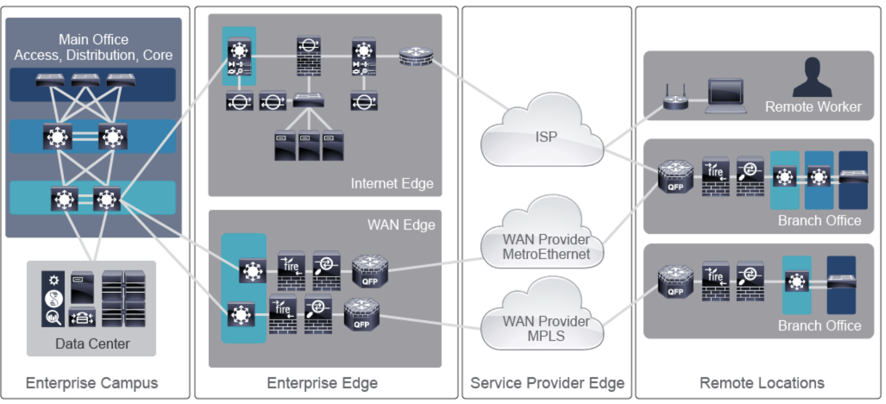

Key concepts for a design should be:
- Self-healing: Continuously on and available.
  - Redundancy is before the issue, Resiliency is after.
- Self-defending: Protecting the organization and its users.
- Self-optimizing: Adapting to changing needs beyond the limits of basic standards.
  - Use triangles not squares
    - Using squares  is problematic for convergence and failover, causing us to have to throw a lot of protocols at the problem.
- Self-aware: Driving change through insight into network activity.

Future trend considerations:
- Scalable over time to meet growth demands
- 802.* wifi standards and AP to switch bandwidth
- POE needs, and perpetual power during upgrade/reloads
- Compliance (MACsec, Analytic exports (netflow))
- Policy to IoT via CTS
- Increased bandwidth demands (2x, 4x) over the life of the network
- Longevity of equipment


# Layer Two <a name="LayerTwo"></a>

## LAN Switching <a name="LANSwitching"></a>

- Three types of VLAN:
  - Standard 1-1005
  - Extended 1006- 4094
  - Internal (used by the switch, default to allocate from extended range lowest number first)
- Vlan1 is the default VLAN & is what is used for carrying control BPDUs, such as CDP/DTP/STP/VTP
  - You cannot deactivate VLAN1, but you can prune it from trunk links this is know as VLAN 1 miniaturization
- Best practice would be to assign unused ports to a non Vlan1 & deactivate that VLAN.
  - To deactivate the vlan you do it under the vlan database ```state suspended``` will be seen
    - To deactivate the vlan locally you shut it down via the ```shutdown vlan x``` or shutdown under the vlan configuration.
- Vlans 1002-1005 are legacy for TR & FDDI
- For a VLAN to communicate between switches you need three things:
  - A CAM table which is created for per VLAN instance that contains learned MAC address for that VLAN.
  - A STP instance that is created per VLAN.
  - A trunk port to carry the VLANS between switches (whether .1Q or ISL)
- A switchport can also be a routed port by disabling the switchport functionality.
  - This essential creates an internal VLAN to map the IP address you assign to the port, however an STP instance will not be created.
- To use the extended VLANS 1006-4094 for STP (so not internally assigned) you need to be:
  - Running VTP in transparent mode.
  - Running VTP version 3.
- Routers can perform trunking by using sub-interface
  - under the sub-if use the encapsulation dot1q command
  - for native vlan use either the physical interface or ```native``` keyword under sub-interface after the vlan.
    - best practise is to use sub-int, as can still read if there is a vlan tag + COS values.
- Layer 2 port types:
  - Access
  - Trunk
    - 802.1Q  L2 ethertype is 0x8100802.
    - 1Q tag has 3 bit priority, one bit CFI bit & a 16 bit vlan id
    - Native Untagged 8021q only
    - ISL is Cisco proprietary (legacy), no native vlan & adds 26 byte header
  - Tunnel
    - Metro tag QinQ
      - 802.1ad is the industry standard "provider bridges"
      - 802.1ah is another standard called 'Provider backbone bridges / L2TPv3 / EoMPLS / VPLS'
      - QinQ tags incoming header with a new tag, the S-tag
        - A bit like Transport labels for MPLS
        - Use ```vlan dot1q tag native``` to tag all over trunks to prevent vlan hopping/leaking/black-holing.
        - CDP/VTP can pass over QinQ service.
        - allow system mtu of 1504 (+4 for new S-tag) on 100Mbps links
        - allow system mtu jumbo 1504 for 1G & 10G links.
        - configured viA
          - ```int X, swit mode dot1q-tunnel, swi access vlan X, l2protocol-tunnel <type>```
  - Dynamic trunks
    - Dynamic auto = will trunk if other side wants to, else access port
    - Dynamic desirable = wants to trunk if other side is auto or des, otherwise will be access.
    - DTP carries the VTP domain name in its messages.
      - Switches will only neg a trunk if the VTP domain name is the same on both, or one side its NULL.
      - This is a protection mechanism, as two VTP domains may have same vlans, but serve different purposes.
    - Can use ```show dtp``` to see the states.
- Layer 3 ports = SVI & Native Routed Interface


```Ethernet headers```

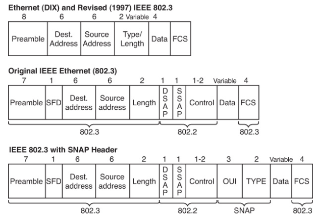


```Destination Address```

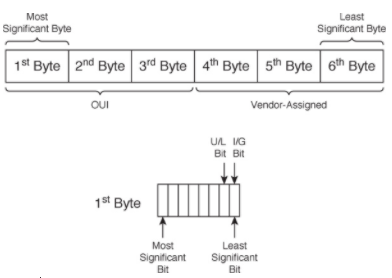


```802.1Q header```

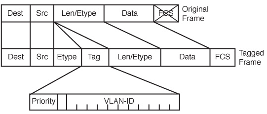

```ISL header```

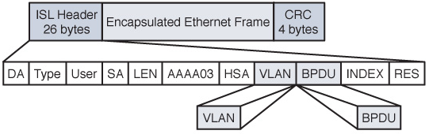


## STP <a name="STP"></a>
---
- Port roles:
  - Root port = forwarding port, lowest cost to root, lowest received neighbor bridge ID, lowest received port priority (default is 128.X (X = ports id, ie 0/0 is 1, 01 is 2 etc)
    - Root is lowest BID (Priority + MAC address)
      - Def priority is 4096+VLANID, can be increased in increments of 4096
  - Designated port = Forwarding port, All ports on root are designated, on nonroot these are ports that receive and forwards frames to root bridge (uses same calculation as root port (with neighbours cost to root))
  - Nondesignated port = Blocking port, typically other end of a designated port
  - Disabled port = Port that is shut down
- 8021d Port states:

| STP mode | Receives BPDU | Sends BPDU | Learns MACs | Forwards Data |
| ---      | ---           | ---        | ---         | ---           |
| Disabled | No            | No         | No          | No            |
| Blocking | Yes           | No         | No          | No            |
| Listening| Yes           | Yes        | No          | No            |
| Learning | Yes           | Yes        | Yes         | No            |
| Forwarding| Yes          | Yes        | Ye          | Yes           |

- 8021s Port states :

| STP mode | Receives BPDU | Sends BPDU | Learns MACs | Forwards Data |
| ---      | ---           | ---        | ---         | ---           |
| Discarding|Yes           | No         | No          | No            |
| Learning | Yes           | Yes        | Yes         | No            |
| Forwarding| Yes          | Yes        | Ye          | Yes           |

```Port proces```
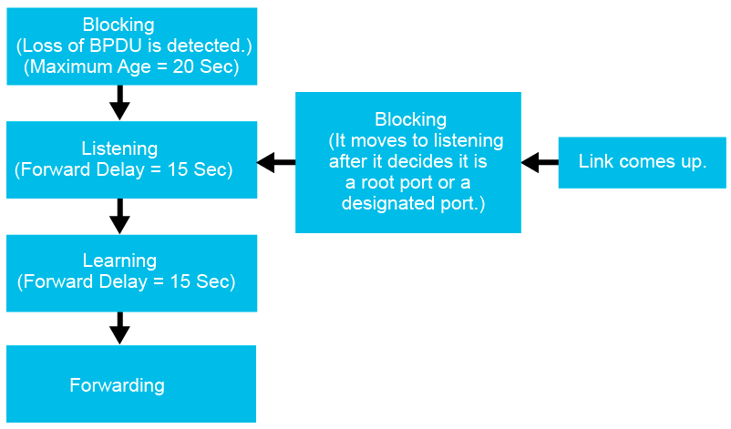

```BPDU```
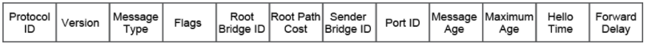


- Messsage types : Configuration or TCN
- Flags : Regular BPDU with the TCA/TC bit set
- TCN are the only type sent towards the Root bridge
- TCN's requre a TCA out the ingress DP the TCN came in on


```Troubleshooting VLANS```
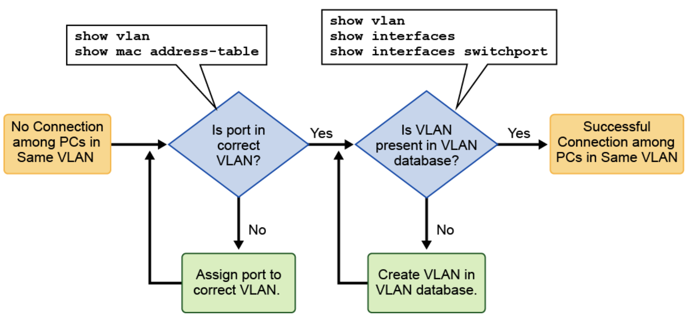


```Troubleshooting Trunks:```
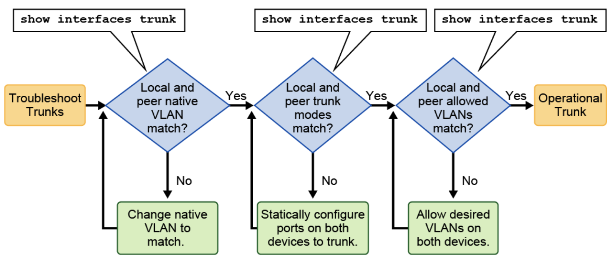


## STP Versions <a name="STPVersions"></a>
---
- 802.1D : one CST/IST for whole bridge domain and all VLANS
  - Max-age = 20 seconds
    - how long before port state deaad (no BPDU seen)
    - how long to listen when port first comes up for BPDU
  - BPDU send evey 2 seconds (hello time)
    - BPDU sent to 01-80-c2-00-00-00
  - Listening and learnign use forward delay time each (15 sec)
- PVST+ : Cisco 8021D that had a per VLAN STP
- 802.1w : RSTP, imporved convergence on 802.1D
- 802.1s : MSTP, multiple STP into regions using 802.1w (can co-exist with 8021D)
  - Uses a CST/IST instance 0 uses just one BPDU on all links to carry all the MST instances and infomation for path selection.
  - Care to prune VLANs on trunks, as the MST instance may use this pruned link (as MST0 is carries on all, unlike STP where pruning stops STP on that link)
  - Need set Region Name (32b) + Revision (2b) + VLAN association tables (0-4096)

  - The Region+revision are sent in the CST BPDU, but only a digest of the VLAN mapping
  - MST Boundary ports:
    - if the recived digest differes from self caluated, port considered region boundary
    - ```show spanning-tree mst configuration digest```
  - Deignated bridge on a segment in a differnet region, or MST receives 8021D BPDU's.
- Rapid PVST+ : Cisco per vlan STP ased on 802.1w


```ios-xe MST
spanning-tree mst configuration
 name SAM
 revision 1
 instance 1 vlan 1,3,4,6
 instance 2 vlan 2,8-9
!
spanning-tree mode mst
```

```Portfast & BPDU guard```
- portfast
  - Immediate transition to the forwarding state
  - Configured only on access ports
- BPDU guard:
  - If BPDU is received, it shuts down the port
  - Usually used in combination with PortFast
```
conf t
 !!Enable features on all non trunking ports
 spanning-tree portfast bpduguard default
 spanning-tree portfast default
 !
 !!enable features on specfic ports
 interface FastEthernet0/1
  spanning-tree portfast
  spanning-tree bpduguard enable
  !
 interface FastEthernet0/1
  !!Set as switchport, enable portfast and disable port-channelling
  switchport host
show spanning-tree summary
show spanning-tree interface FastEthernet0/1 portfast
```


## VTP <a name="VTP"></a>

- VTP comes in three versions & only transmits over trunk ports.
	- 1 is the default and carries normal range vlans only
	- 2 adds token ring support & passes unknown TLVs in the VTP messages.
    - added optimized consistency checking (only check the database on the devices where change was made).
  - 3 new server roles of primary & secondary
    - only 1 primary allowed, only he can modify the vlan database
    - being primary is a runtime task that is requested in exec mode.
    - on promotion the new primary floods vlan database to all, even if rev number is lower.
    - a secondary server can be promoted to the primary
    - VTP password stored an encrypted, this password is needed to promoted a primary.
    - Can carry standard, extended and private vlans
    - Pruning only applied to standard vlans.
    - Can be turned off, it drops all VTP packets. This can be set per trunk.
    - V3 is a mechanism for distributing contests of arbitrary databases as such:
      - Can be used to Sync MST region info between switches.
      - Clients and servers must agree on who is the primary & his MAC to allow changes to themselves
      - If switches have different info about the primary, this is a conflict.conflicting switches do not sync with rcx updates, even if other parameters match.
      - To reset rev num back to 0, you need to change domain name or configure a password.
      - If VTPv1 or 2 detected, it will revert to VPNv2 on that port.
    - VTP 1 & 2 messages:
      - Summary advertisement: srv/cleint orin every 5 min or after modification, has info on:
        - doma name, rev num, ID of updater & time stamp, MD5 sum of vlan dat & password, password, number f subset adv to follow.
      - Subset advertisement: srv/clinet after mod vlan database has:
        - full contents of vlan database
      - Advertisement request: srv/cleint to request all or part of the vlan dat.
        -Sent when client restarted, enters client mode, rcx summary with higher rev number.
      - Join: srv/cleint every 6 seconds if pruning is active:
        -bit field for each normal vlan, indicates if its active or unused (pruned).
- VTP Transparent will only forward VTP updates if domain name matches or the TP bridge is set to null.
- for VTP V1 & 2 to use private vlans it needs to be transparent.
- Switches default to VTP server mode, but dont send VTP message until they have a domain configured.
- When running VTP, vlans databse is stored in vlan.dat in flash, not in NVRAM.


## Port Aggregation <a name="PortAggregation"></a>
---

Need for Etherchannel
- Combine muliple physical links into one logical one
- Allows STP to unblock would be redundant links
  - Gains Additinal bandwidth
- Load sharing flows over links based on:
  - dst IP or MAC or Port
  - src-dst IP or MAC or Port
  - src IP or MAC or Port
- Load sharing hash done via:
  - looking at low order bits if using one IP/MAC (ie the last N bits)
  - XoR the last N bits is src/dest used (like last bit of src-dst IP)
  - N is 2 for two links, 3 for 8 (2^2=4, 2^3=8)
    - Three links will be 2:1:1 used, so even is better
- Redundancy as multiple links in one logical one
- Cannot mix:
  - Port Speeds
  - Duplex
  - VLAN information on member ports (access vlan, trunk allowed lists)
  - Port type (routed | access | trunk)
- Can mix
  - Ports over linecards, chassis (Stacks)
- Modes
  - LACP (IEEE specification 802.3ad)
    - Active/Passive modes
    - Port capabilities are learned and compared
    - lowest system priority is master and decides port participants
      - 16 links can be assigned, only 8 used based on prioriy
    - If negotion fails, member ports can fall back to individual (I) trunks|access links within a disabled (D) etherchannel
    - For LACP Lower port priorities are better
  - PAgP (Cisco proprietary)
    - Desirable/Auto
    - memeber ports need identical VLAN
    - For PAGP Higher port priority is better
  - Static
    - On
    - No peer check for consistend settings
- Setup
  - ID ports, config physical ports, config etherchannel, verify
  - Always try to use an even number of ports (for load balaning ease)
- EtherChannel Guard
  - detects misconfigurations between a switch and device
    - ```spanning-tree etherchannel guard misconfig```

```
conf t
 interface range gig 0/1 - 4
  channel-group 3 mode active
  shut
!
 interface portchannel 3
  switchport mode trunk
  no shut
  !
show etherchannel summary
show etherchannel groupnumber detail
show etherchannel load-balance command
show etherchannel traffic
```
```EtherChannel process```
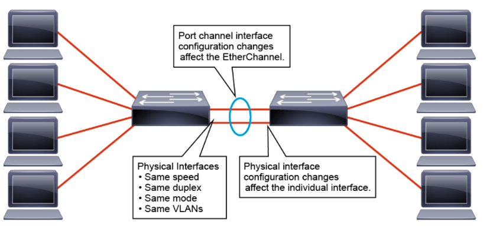

# Layer Three <a name="LayerThree"></a>

## EIGRP <a name="EIGRP"></a>
---

- RFC 7868 based
  - only a few vendors using a Linux-based router OS have EIGRP support
- Bellman-Ford-based distance vector protocol
- Partal updates sent on convergence
- Rapid convergence:
  - Diffusing Update Algorithm (DUAL) used
    - Has backup rooutes (feaisble sucessors) that can be auto installed
    - Else used queries to resolve loss of path
- Load-balancing
  - equal and unequal metric based load balancing
- Loop free & classless
  - Advertises mask with each subnet for VLSM
- Multi AF
  - IPv4, Ipv6, distrbute dial plan for VOIP via CUCM intergrations, plus PFR using SAF
- Reduced bandwidth
  - Partial updates with changes only
  - unicast or multicast updates (224.0.0.10)
- Protocol 88
  - RTP used for guaraneed, ordered packet delivery
  - Select packets are sent reliabalby, needing an ACK

```EIGRP Packet```

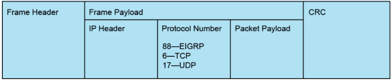

- Eigrp Tables
  - Neighbor = all my neighbors and adjacencies
  - Topology
    - All destination routes from neihgoburs
    - Each entry has a list of neighbors that advertised reachability and recieved metric
      - If the recieved metric (Advertised Distance) is less than our successor route, this is deemed a Feasible successor (FS)
        - FS path can be instantly used if hte sucessor route goes away
    - Each entry has local routers own metric to reach the destination
      - Advertised metric + egress link cost to neighbor
      - BEst metric is the successor route and placed in the routing table
  - Routing
    - Best paths from topology table, candidate for CEF/FIB

```EIGRP process```

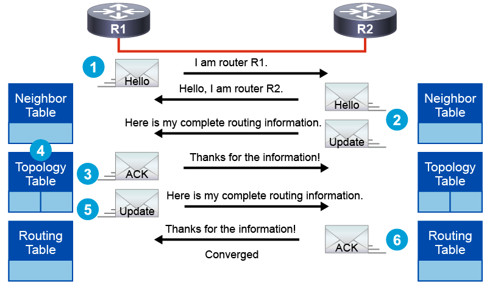


1. R1 up, sends hellos to all EIGRP enabled interfaces
2. R2 recives and sends hello back (plus route updates)
  + Route updates exhanged during neighbor sync
3. Neighbor adjacencies are established, R1 replies to R2 with an ACK packet, indicating that it received the updated information sent
4. R1 assimilates the topology table with SR and FS routes
5. R1 sends route update to R2
6. R2 sends ACK on this update to R1


- Packet types
  - Hello : neighbor discovery, multicast sent
  - Update: Convay routes to peers via multicast updates. Unicst used when syncing with new neihgbors, updated need an ACK.
  - Query : Send when looking fo a FS rooute upon lost route, need ACK.
  - Requests: Get info from peer.
  - Reply: In respinse to a quiery packet, send unicast and ack the reqest also
  - Ack: Unciast emplty hellos and Used to ACK updates, queries,

- Forming neighbors:
  - AS, K values, subnet and authentication need match
    - K=BLDRM, only Band (K1) and Delay (K3) used by default

- K-Values:
  - K1 = Bandwidth: Lowest best
  - K2 = Load: Worst load on route based on packet rate
  - K3 = Delay: Cumlative interface delay (tens of microsends (us/10))
  - K4 = Reliability: 0-255
  - K5 = MTU: Min-Max MTU in bytes

- Path cost = ```(10^7/Lowest BW kbps) + (Cumulative Delay /10) * 256```

- Wide metrics (best practise to enable)
  - without these 10Ge costs the same as 1Ge
  - Feature supports 64-bit metric for up to 4.2TBps links
  - changes K values to use:
    - K1 = minumum throughput of links in picosconds ```(107 * 65536)/Bw```
    - K3 = Total latency ```(Delay*65536)/10``` or ```(107 * 65536/10)/ Bw```
  - Need increase RIB to allow large metircs via ```metric rib-scale```

- MTU K value:
  - Enaged, but only used to tie break when to many best paths
    - Highest min MTU is preffered.

- Load balance
  - up to 4 equal cost routes of metric minimum installed by Cisco, max is platform dependant
  - Can be done uneqally:
    - alt routes meetthe feasbilty considion and are less than the succsssor multipler (1-128)
      - Tunred off by default with a varience (multiplier) of 1
    - Its weighted based on metrics and the traffic share setting:
      - ```traffic-share balanced``` : disbibuted proprtianly
      - ```traffic-share min accross-links``` : minimum sent accross the lowest cost path

- EIGRP Filtering with Passive Interface
  - Setting an interface as passive stops hellos/updates from being sent out the IF (224.0.0.10)
  - Prevents neighbors being formed on these links, while still advertising the links into EIGRP.

- IPv6 EIGRP differences
  - Hellos to Link local on Mcast address of all EIGRP routers FF02::A
  - Adjecnces form over link-local addresses
  - Next hop use link-local

- Convergene


## EIGRP vs OSPF vs ISIS <a name="EIGRPvsOSPFvsISIS"></a>
---
|                  |  EIGRP        |   OSPF      |  ISIS    |
|              --- |  ---          | ---         |      --- |
| Setup            | Easy          | Hard        |      TBC |
| Design           | Flexibe       | Rigid       |    TBC   |
| Scalability      | Med/Large     | Large       |   Larger |
| CPU/Mem,BW       | More          | Less        |        Y |
| Provider support | Less likely   | More Likely |        Y |
| Load Balancing   | Equal/unequal | Equal       |        Y |

```Convergence comparison```

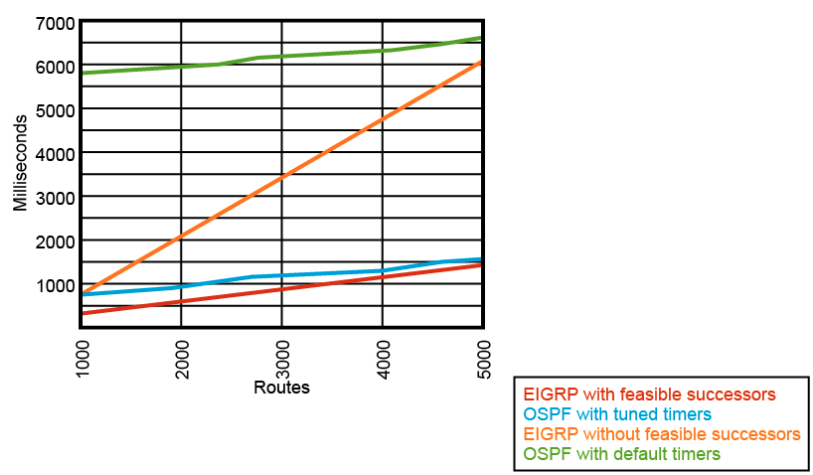


# OSPF <a name="OSPF"></a>

## Basics <a name="Basics"></a>
---

- Link-State
  - Details of local links stae, speed, type
  - all nodes should have all area LSA's
  - Floods evenry 30 min if no change been seen
- Standards based
- Used Dijkstra SPF alorithm
  - Cost used, derived from E2E bandwidth
  - SPF run against the whole LSBD
- Triggered, incrmental updates using LSA's
  - Mulitcast updates
  - Updates sent on topology change
- Classless
- Hierarchical design
  - Has a backbone area
  - Inter area summarisation
  - Areas limit flooding
  - Area Border Routers (ABR) between areas
  - Automonous system Boundary Routers (ASBR) between OSPF and other
- Automonous system use
- Protocol number 88 used

## OSPF process <a name="OSPFprocess"></a>
---
- RID s used to ID the OSPF node itself, so needs be uniqie
- Selecting the OSPF RID
  - Manually configured using the router-id X.X.X.X command (best practices
  - Highest IP address of an active loopback interface.
  - Highest IP address of an active physical interface.
- OSPF Process ID (32 bit number)
  - Good practise = Match the PID to the router ID for ease of sripting/automation

## OSPF neighbors <a name="OSPFneighbors"></a>
---
- Used hellos every 10 seconds (dead time is 4xhello)
  - All OSPF routers 224.0.0.5
  - All OSPF DR/BDR routers 224.0.06
- Neihgobrs need to match on
  - Area ID
  - Hello/Dead timers
  - Authentication
  - Stub flag
- MTU on the segment needs mach to exchange the LS database
- Phases of peering up
  - Init
  - 2WAY
  - ExStart
  - Exchange
    - DBD's send
    - DBD is LSAck'ed
    - LSR's
    - LSU's
    - LSAcks for the LSU's
  - Loading
  - Full
-  LSA types:

| LSA | Description | Info    |
| --- | ---         | ---     |
| 1   | Router      | All routers links within a area
| 2   | Network     | DR's send info on multiaccess links
| 3   | Summary     | ABR for links between areas
| 4   | ASBR summary| LSA on how to reach the ASBR
| 5   | AS system   | External links attached to ASBR
|6-11 | Others      |

- Network Types:

|Net type|DR/BDR|Hello|Dyn discovery|Multiple routers|Link type
|---|---|---|---|---|---
P2P|N|10|Y|Y|Serial or P2P-FR
Broadcast|Y|10|Y|Y|Ethernet
Non-Broadcast|Y|30|N|Y|FR ot ATM
P2MP|N|30|Y|Y|DMVPN H&S
P2MP Non-BC|N|30|N|Y
Loopback|N|-|-|N

## OSPF areas <a name="OSPFareas"></a>
---
- ABR's can summarise between areas
- SPF constrained to areas
- Larger areas = larger routing tables


# Routing <a name="Routing"></a>
---

- Load balance ECMP
  - up to 4 equal cost routes minimum installed by Cisco, max is platform dependant
  -

- CAM
  - CAM tables provide only two results: 0 (true) or 1 (false). CAM is most useful for building tables that search on exact matches such as MAC address tables.
- TCAM
  - TCAM provides three results: 0, 1, and "don't care." TCAM is most useful for building tables for searching on longest matches such as IP routing tables organized by IP prefixes.


# Redundancy <a name="Redundancy"></a>
---

- FHRP
  - When you have dual gateways that share a single VIP+MAC
  - Active gateway repies to ARP with vMAC
  - used hellos and dead times to track peer state
  - HSRP
    - RFC2281 was Cisco Proptiary
    - Active and standby gateways
    - Only one active forwarder per group
    - Needs three a uniqie VIP
    - Higher prioprty is master, defualt is 100 wiht no preemptipn
    - defaukt hello+hold are 3+10
    - Can tune hello/dead preempt timers
    - Can track interface states and adject priority
    - Can have MHSRP where where each SVI can be a HSRP group (one per VLAN)
    - MD5 or clear text auth
      - ```standby 1 authentication md5 key-string VerySecretPassword55```
      - ```standby group authentication string```
    - Version1:
      - 224.0.0.2
      - 0000:0c07:AC**
      - 255 groups
    - Version 2:
      - 224.0.0.102
      - 0000:0c9f:F***
      - 4096 groups
    - ```HSRP states```
  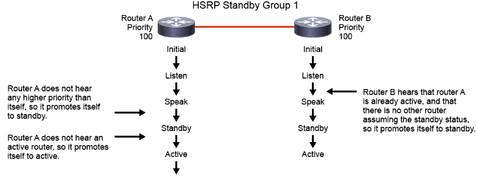
  - VRRP
    - Standards based, RFC5798
    - Master and backups used
    - Priority based between 0 and 255.
    - One active forwarded per group
    - Only the master sends advertiemnts (hellos)
    - uses 224.0.0.18 and protocl number 112
    - hello and hold are 1+3 by default
    - Can use a physcial IP as the VIP
    - Can use MD5 auth or clear text
  - GLBP
    - Cisco propitary
    - Multiple active forwarders per group

- High availabilty
  - Route Processor Redundancy (RPR):
    - Standby is only partially booted
  - Route Processor Redundancy Plus (RPR+):
    - Standby is booted, no L2/L3 functions started
  - Stateful Switchover (SSO):
    - Standby is booted, config is in sync, L2 info mainteied on both sups
    - Non Stop forwarding(NSF)
      - Used to quickly rebuild the RIB after a SSO
        - The RIB is used to generate the FIB table for CEF

|Redundancy mode  | Behaviour when active fails | Failover time|
|---              | ---                         | ---           |
|RPR  | Standby module reloads every other module, initializes all supervisor functions. | >2min
|RPR+ | Standby module finishes initializing without reloading other modules. | >30seconds
|SSO  | Standby module is already initialized. | >1second
|SSS+NSF | Same as SSO + RIB is rebuilt | >200ms

# Network Address Translation (NAT) <a name="NetworkAddressTranslation(NAT)"></a>
---

- NAT address locations names:
  - Inside local address: IP address of the host
  - Inside Global address: The address the inside local address is translated to
  - Outside Global address: tranlsated IP address of an outside host
  - Outside local address: IP adress of an outside host on its own local network
- Types of NAT
  - Static NAT : Maps public to a prive IP, used for outside hosts to reach inside hosts
  - Dynamic NAT : Maps private to many pubilc IP's for inside to outside reachabilty
  - PAT : Maps many private IP's to a single public IP
- NVI (NAT virtual inteface):
  - Removes need for specifign inside/outside intefaces
  - Perfroms routing, translation then routing again (where insdie/oputisde interface mode is routing then NAT)
    - This fixes packets that gto INSIDE to INSIDE interfaces that would otherweise get translated
  - NVI not supported on IOS XE
  - Configuration:

  ```python
  !!NVI
  access-list 10 permit 192.0.0.0 0.255.255.255
  ip nat source list 10 interface eth 0/1 overlaod
  int range eth 0/0-1
   ip nat enable
  !
  !
  !!Classic NAT
  int eth 0/0
   ip nat inside
   !
  int eth 0/0
   ip nat outside
   !
  !!Static 1to1 NAT
  ip nat inside source static local-ip global-ip
  !
  !Dynamic NAT
  ip nat pool pool-name start-ip end-ip {netmask netmask | prefix-length prefix-length}
  access-list access-list-number permit source-ip [source-wildcard]
  ip nat inside source list access-list-number pool pool-name [overload]
  !
  !PAT NAT
  access-list access-list-number permit source-network [source-wildcard]
  ip nat inside source list access-list-number interface interface overload
  ```

# Vitulisation Techniqies <a name="VitulisationTechniqies"></a>
---

- Server virtulisation:
  - Abstracts physical resources from the serivces they provide
  - Layer of software is betwen the hardware and the running operating system/application
  - ```Virtulised server```


  - Allows multiple operating systems to be installed on a single physical server.

- Network virtulisation:
  - Providing seamingly: dedicated network providing privacy, security, an independent set of policies, service level, and even routing decisions
  - Three main functions of hte network virtualization architecture
  - ```Virtulised network```
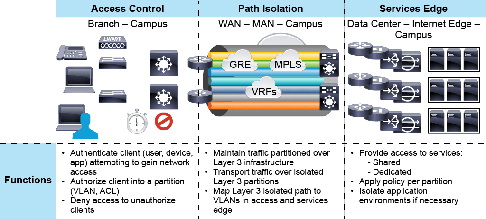

- Path isolation
  - Independent logical paths over shared physical network via VPN's
  - VLANs are used at layer 2 for a broadcast domain
  - VRF used at layer 3 (has own controll plane and RIB/FIB)
  - Hop by hop via VRF/8021q
  - Multiphop via tunnells like GRE/MPLS
  - Each virtual domain neeeds virtulise:
    - Control plane: protocols, databsses to make forarding descions
    - Forwading plane: tables needed to forwards traffic

```Service offerings```
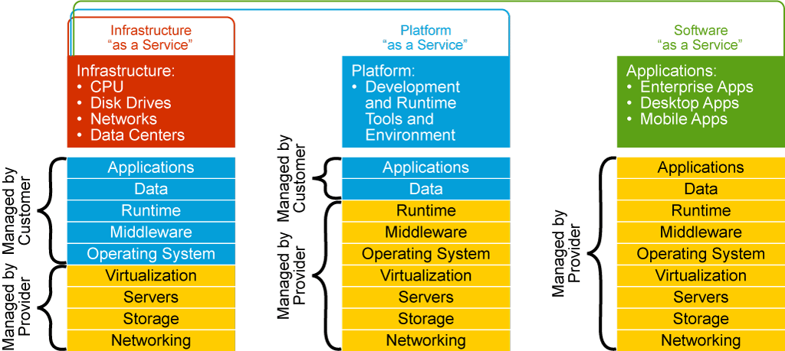
- IaaS : provides hardware for a VM to run
- PaaS : provides OS and network
- SaaS : provides software, OS, network

# VPN Techniqies <a name="VPNTechniqies"></a>

# Wireless <a name="Wireless"></a>

## RF Principles <a name="RFPrinciples"></a>

- RF Spectrum
  - 1Mhz is on million times per second
  - 1Ghz is one billion times per seconds
  - Wifi Sits in the lower end of the microwave spectrum 1-5Ghz
    - Hz = Cycles per second (cycle is time between two same points in a wave)
    - Wavelength is defined as the distance covered in one cycle

- Free path loss
  - Where signal rediates out from the source, and looses power over distance due to:
    - Signal is send out in mulple directions, so the data points are less the further out
    Recieveing antenna is smaller so can only collect smaller set of data poaints (bigger antenna is better as collectes more)
  - A directiona antenna can close the first issues, when singal is not sent out like a ripple.
```free path loss```


- RSSI & SNR
  - RSSI is a measuemnt of how well a deivce recives a signal
    - Measured in dB using milliwatts (dBm)
    - Range from 0 (no signal) to 255 (most vendors max is measured as 60-100)
      - 0 = cica -95dBm
      - 100 = circa -15dBm
      - Good for Cisco is -67dBm or better (eg -55dBm)
    - the recived mangnetec and electric fields are trnsformed into electic power by the transistor.
  - SNR is evaluation of signal strength after its been effected by noise  (RSSI - Noise = SNR)
    - Noise (not SNR) measured in dB 0 to -120, where lower is better and a typical noise floor is -95dB.
      - SNR measures in a posotive values form 0 to 120, where 120 is best & 20+ is good.
      - SNR comapres RSSI and Noise, where:: RSSI - Noise = SNR
        - RSSI -55Dbm, noise is -95dBm = 40dBm SNR
  - SINR
    - This is SNR plus the noise radio (any interference to the signal)

- Watts and DB
  - Watts is energy consumed per secopnd (1w = 1joule of energey per second)
    -a joule is eneergey generated by a force of 1 newton moving 1m in one direction.
      - A newton is the force requred to accelerate 1kg at a rate of 1m per second squared.
    - A typcial AP would use 100mW
  - Db is a logarithmic unit expressing the amount of power releative to a refernce.
    - 10Db is 10x more powerfull than the refence
    - 3Db is is 2x more powerfull than the refence
    - Can measure electric power of a transmittter, or electromangmentic power of an anttenna:
      - Transimitter use mW (where +3dBm = 2 mW, 10dBm = 10mW)

- Effective Isotropic-Radiated Power (EIRP)
  - How much energy is actually radisated from the antenna:
    - TX power (10Dbm) + Antenna gain (6dBi) - cable loss (-3dB)  == 10+6-3 = 13dBm)

- dBd vs dBi vs dBm
  - d - dipole antenna, i - isotropic antenna
    - iso is a 360 degreee redaiation
    - dipole is directional
  - m is meteres, loss/gain per metre

- Antenna characteristics
  - diploe (Omnidirectional)


  - Directional (Yagi (pole style), patch (flat panel))
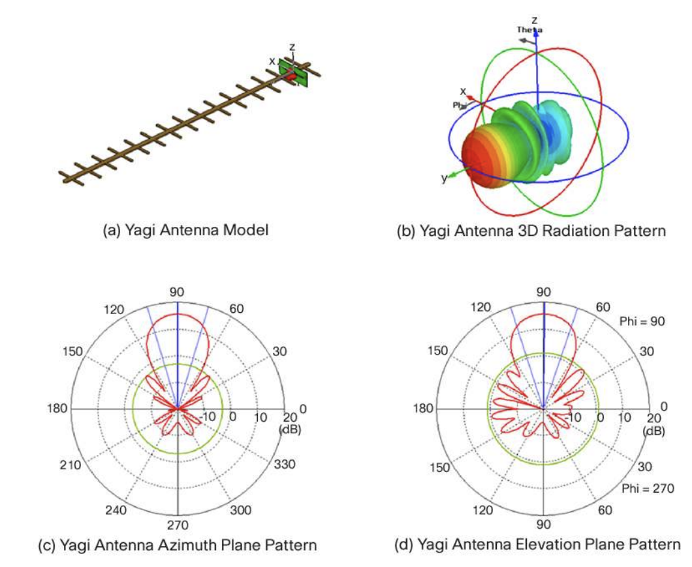

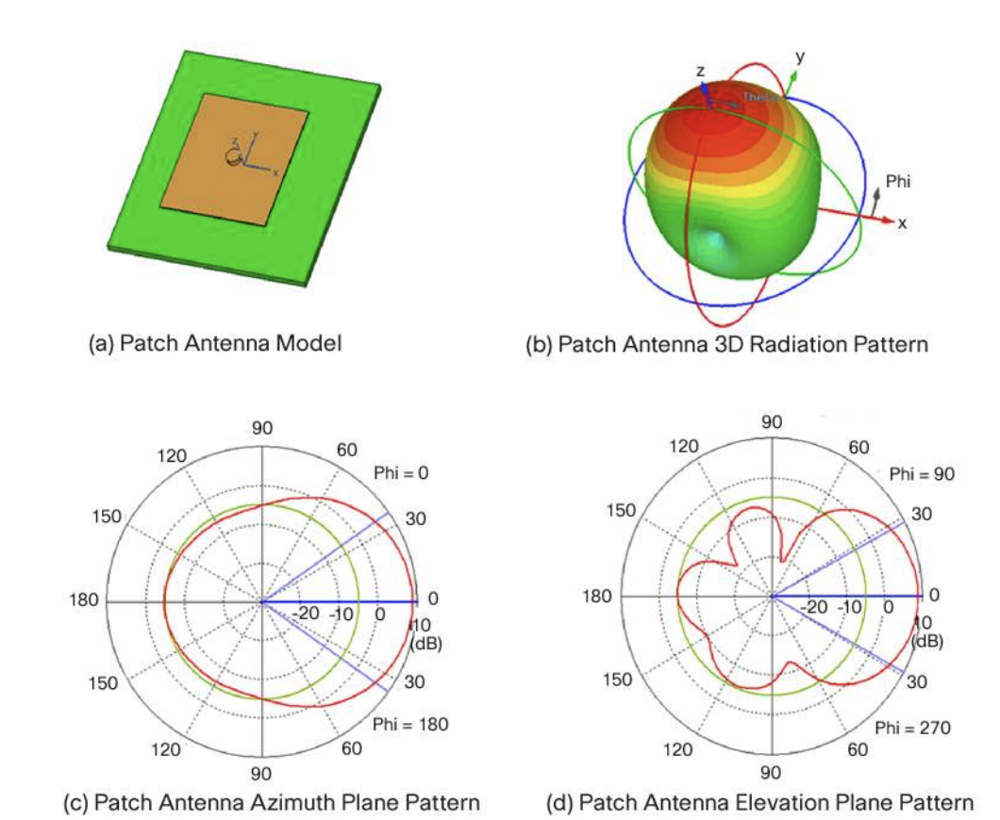


- Beamwidth
  - mesures the angle of an antenna pattern in which the relative signal strength is half-power below the max value
- Polarisations
  - radiated electromagnetic waves that influence the orientation of an antenna within its electromagnetic field
- Radiation patterns
  - a graph that shows relative intnesity of the signal strength of an antenna within its space
- gain
  - the relative increase in signal strength of an antenna in a given directions.

- Standards
  - SISO: 802.11a/b/g = Single In Single Out:
    - One radio that swithced between the 2.4 or th 5g antennas when needed
  - MIMO: (Multiple Input Multiple Output):
    - Multple antennas and radios combined to send several frames over several paths.
    - Uses three technologies
      - Maximal Ratio Combining (MRC)
        - Receiver combines energies from multiple recieve chains (so direct, bounced of a wall etc) from multiple distinct antenna and combines them all to be in phase.. that is you have three recivers and you get the data three times, thus there are three chances for you to read good data and imporve the wireless quality.
      - Beamforming
        - used when there is more than on Tx antenna and the reicever has just one Rx antenna
        - When cleint is stable, Tx source can deduce how long each antenna takes to send sta to it, and send data at differnet phases over both Tx antennas, so that the are recieved in phase with one another on the Rx side.
          - software deifned beams are used when there is a legacy cleint and the Tx side has to guess
          - Explicit beamforming can be used wihen Tx and Rx are all 802.11n with similar capabilites
      - Spatial Multiplexing
        - 802.11n/ac Tx and Rx needed with two Rx and a singe Tx per band
        - Sends muple singles along diffenrt pahts that are combined on the Rx side into one signal
  - 802.11n+ uses channel bonding, packet aggregation and clokc acks to increae throughputs
    - Use of MIMO to extended data rates
  - 802.11ac uses wave1 (1-3 streams) and wave2 (1-8 streams) with MU-MIMO for up to 6.93 Gbps
  - 802.11ax (wifi6) wiht MU-MIMO


```standards```
| standard | year | frenqncy | spatial streams | Transmission | Mbps |
| --- | --- | --- | --- | --- | --- |
802.11a | 1999 | 5ghz | N/A | OFDM | 54
802.11b | 1999 | 2.5ghz | N/A | DSSS | 11
802.11g | 2003 | 2.4ghz | N/A | OFDM | 54
802.11n | 2009 | both | 4 | OFDM | 600
802.11ac | 2013 | 5Ghz | 8 | OFDM | 1300/6930
802.11ax | 2021 | both | 8 | OFDMA | 4800


- Component roles
  - 802.11 cleint to AP connection states:
    - Not authenticated or associated
    - Authenticated but not yet associated
    - Authenticated and associated
      - this last state needs be achived before wireless bridging can occur
  - authentication and association manamgnet frames:
  - ```A&A MGMT frames```
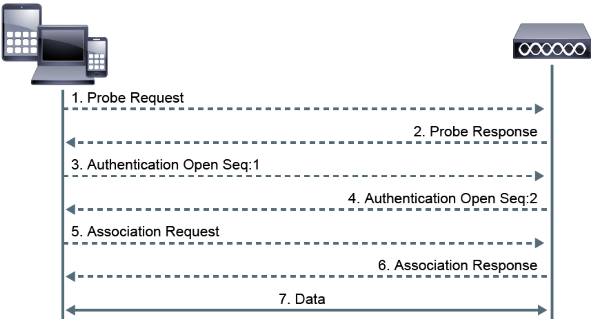

    1) Probe to discovered 802.11 networks advertising my supported data rates and 802.11 capabilites to all F's (so all AP's that Rx will respond)
    2) AP checks for matching data rate, if yes, respond with SSID name, supported data rates, and required encryption.
    3) Client choses compatilbe based on repsonses and attemmpt 802.11 authentication (this is not WPA2, 802.1x which come after) via sending lo-level 802.11 auth frame with auth set to open and a seqnece of 0x0001
    4) AP recives the auth frame and responds set to open with seqnence 0x0002.. (if the AP RCX any frmae other than auth or probe form a non authenticated client, it will send a de-auth to client)
    5) Client sends an association reuqest to the AP, this has the chose encryption cyphers.
    6) If AP agrees on the elements RCX with mathing capabilites, the AP will createa an assocuation ID and respond with a success message.
    7) Now authentication and association have occured.

:

  - Split MAC is where the AP handles some functions (time sensative), the WLC handles others (slow time)
    - Real-time AP handled requests are:
      - Client/AP handshaking
      - TX of beacon frames
      - Buffer and Tx frames for clients in power-save operation
      - Responing to probes, forwaring notifcations of Rx probe requests to the WLC
      - Provide real time signal quality info to the WLC with every Rx frame
      - Monitor radios for noise, interferance, other WLANs and presence of other AP's
      - Provide encrytion/decryption of 802.11 frames
    - slow-time functons are handled by the WLC
      - Authentication (PSK, EAP, 8021x)
      - RF managment (controll of RF space for AP/Clients)
      - Client IP addressing
      - Seamless roaming : L2/:3 cleint roaming
      - QoS for Voice and video data
      - AP config manamgnet (VLANS, IP)
      - AP image management

:

- CAPWAP (Control and Provisioning of Wireless Access Points)
  - tunnels messages beween AP and WLC
  - uses secure encrypted DTLS tunnel for all the controll plane data
  - cleint data also uses CAPWAP but is not encrypted by defualt (can be)
  - Destination UDP data port 5247/5246 (WLC/AP), and port 5246 for controll plane traffic.
- Mobility Agent (MA):
  - Termincated CAPWAP tunnels on the WLC
  - Configures and enfomrces security and QoS polices for wifi clients
- Mobility Controller (MC):
 - Mobility MGMT like RRM, WIPS, guest access
 - So it basically takes care of systemwide functions
 - MA reports local and roamed client states to the MC
  - The MC builds a database of all client station across the MA's
- POP/PoA (Point of Presence/Point of Attachment)
  - Before roam, both POP/PoA are on the same WLC
  - POP is where the wifi client is seen to be within the wired portion of the network
    - If ARP was done for this client, it would show that its over the 8021q trunk towards the WLC (if CAPWAP used)
    - The POP anchors the client IP address, where the client may roam AP to AP or even over subnets.
      - For a L2 roam the POP & PoA will move to the new WLC
      - For L3 roam the POP will stay and the PoA will move to the new WLC
  - PoA is the WLC where the cleint AP CAPWAP curnet terminates.
  - If user roams, the PoA may move to a new WLC.


## Wireless Deployment options <a name="WirelessDeploymentoptions"></a>

- Autonomous
  - Hotspots, or small enterprises
  - AP's are managed individually
  - Traffic flow
    - Wireless -> Wired : 802.11 to AP, 802.3 to swithch then on
    - Wireless -> Wireless (same AP/subnet-VLAN (poss diff WLAN/Radio)) : Bridged at the AP
    - Wireless -> Wireless (same AP, diff subnet/VLAN+WLAN ) : sent to switch towards L3GW to route
    - Wireless -> Wireless (diff AP) : Always goes via the upstream switch to be bridged/routed
- Centralised
  - Campus network
  - APs mananged by hte central WLC
  - Traffic flow (Local mode)
    - Wireless -> Any : CAPWAP from the AP to the WLC (where WLC can apply policy ACL/QoS)
    - WLC -> Any : Decaps CAPWAP, applies ingress policy, forwards to egress VLAN or Port for dest:
      - VLAN on another WLC : routed to last hop, if ARP needed the owning WLC will reply with it's MAC to the upstream gateway.
      - Another AP on same controller (Same subnet) : packet is forwarded by the WLC post ingress policy
      - Another AP on same controller (Diff subnet) : Packet forwarded to controller interface associated to the source VLAN.
      - Same AP : Same as above inter-AP for intra-AP (else the WLC cant apply policy)
- FlexConnect
  - Used for branch or remote offices
  - Small Qty of APs where local WLC is not desired
  - FX central switching
    - All traffic tunneld back to the WLC
  - FX local swithcing (central auth)
    - All user traffic is broken out locally at the wired interface ()
  - Split tunnelling
    - AP will use Central and local swithing based on the traffic destination
  - Need 300ms/100ms RTT for central swithced for data/voice
  - 500 Byte MTU added to WAN
  - sitewide VLANs needed for roaming (FX local switching)
  - CAPWAP for WLC-CP is about 0.35 kbps per AP ongoing
    - If WLC becomes unreachable:
      - existing sessions are maintained
      - the AP takes over cleint authC for localy swithced WLANS
      - Centrally swithced WLANS get disconnected
- SD Access
  - Intergration with SDA
  - Similar to FX local swithing
  - Replies on Group-based acccess not vlan based
- Cloud-mananged
  - Meraki or the 9800 cloud contriller
  - Cenrallised instalation and manangment
  - Scales from small to large networks
  - Meraki APs use FX local swithcing, CP traffic to the WLC, user traffic breaks out locally.
  - 9800
    - EWLC supports 200 AP's 4K clients per, can have max two per site (400/4K)
      - Runs on an SDA BN+CP node and only supports SDA wiht fabric mode AP's
    - 9800-CL is a VM (6K AP 64K clients on prem, 1K AP and 10K clients in cloud)
    - 9800VM (S/M/L AP/Client = 1K/10K : 3K/32K : 6K/64K)
      - 1.5 Gbps in centralised model
- Cisco Mobility Exrpess
  - Virtual WLC within the AP
  - Needs a mobilty express image installing on wave2+ AP
  - Master AP : runs the WLC CMX code (100 Ap's and 2K client support)
    - Supports secondary Master AP (HA)
  - Subordinate AP: Aironet image AP's
  - All AP's need be in the same VLAN (to have L2 reachbilty between them)
  - Uses central AuthC and local switching (like FX local)


## Roaming and location services <a name="Roamingandlocationservices"></a>

- Roaming causes:
  - Max retries exceeded
    - Excessive numbers of data retries, where this is threshold driven.
  - Low RSSI
    - If this drops below a threhold a client may decide to roam
  - Low SNR
    - If the RSSI and noise fall below a threhold, clinet can decide to roam
  - Proprietary roaming parameters
    - WLC may signal to a cleint to roam to balac the clinet to AP ratios
      - Cisco WLC has roaming params that a cleint can adopt to help decide when to roam.
- Dynamically alter the roam algorithm attributes:
  - Client data type :: as an exampls 'voice call in progress' wil try to prevent a roam
  - Background scan infomration :: this is obtained during a routinge periodic background scan
- Scanning for a new AP
  - During a scan a cleint cannot TX/RX data
  - clients lean about AP's by scanning 802.11 channels for avaible APs on the same SSID
  - Active Scan:
    - Cleint changes radio to the channel to scane, boadcasts probe, waits circa 10ms for respose (or waits to head periodic AP beacons)
      - Directed probes : send to specifc SSID, so only APs with that will reply
      - Broadcast probe : broadcast/null SSID, all APs will respond with all SSIDs they have
  - Passive scan:
    - Change radio channel and wait for a perodic becon from any AP..
    - AP's send beacons circa every 100ms
  - Backgorund scanning : scan pre roam when cleint is not sending data. Allows build the picture of RF enviroment in case of future roam needed.
  - On-roam scanning: scna takes place only when a roam is nessassary.
- Alter the scan algorithm:
  - Scan a subset of channels (info from a background scan ucan determine whcih channels local APs are using)
  - Terminate scna early (in a call in prgess, stop when first acceptable roam-to AP is found)
  - Change scan timers (if a callin progress, lower time wait for probe responses in an active scan)

:

- Mobility groups and Domains:
  - Mobility group (MG) is collection of Mobilty controllers (MC) that need to support romaing between them
    - Can be up to 24 WLC that share context and state of cleintd deivces and WLC loading infomation
    - WLC's in the group can forwards data among themsleves to allow roaming and redundnacy
    - WLC in the MG need to be L2 adjacent, share VLAN infomation.
    - To be in a MD the WLC needs know the MAC+MGMT IP of each other controller
      - control mesages send UDP 16666 and data encrypted in EoIP procol 97 or CAPWAP UDP 5246 tunnels
    - MGs need have the same:
      - Domain name :: Code version :: CAPWAP mode :: ACLS :: SSIDS
  - Mobility group domains provide roming between mukpilte Mobility groups
    - Can have up to three mobility groups in a Mobility domain
    - Supports up to 72 WLC's
  - Client can roam within a MG without need to re-auth.
    - If cleint roams to AP on differnt WLC, the infomaiton will be transfered to it.
  - WLC recognise a controlelr in a diff mobilty group, if this occurs they are said to be in the same Mobility domain.
  - If cleint moves to WLC in same Mobility domain but differnt MG, cleint needs re-auth & re-IP

:

- Roaming types
  - Client database on the WLC has (to allow it to forward frames to the AP):
    - MAC/IP of client
    - Security context and associations
    - QoS contexts
    - The WLAN
    - The associated AP
  - L2 roam
    - Client moves AP, keeps same subnet/VLAN
  - L3 roam
    - Client moves AP to same SSID that has a different VLAN/subnet
    - WLCs need be in same mobility group
    - In intersubnet roaming, WLANs on both anchor and foreign controllers need to have the same network access privileges and no source-based routing or source-based firewalls in place. Otherwise, the clients may have network connectivity issues after the handoff.
  - Intracontroller Roaming
    - L2
      - When Client roams it asks for re-auth on new AP.
      - AP queries its WLC, and WLC updates the client databse with new AP data
      - If necessary, new security conitext and associations are established.
  - Intercontroller Roaming
    - L2
      - When Client roams it asks for re-auth on new AP.
      - AP queries its WLC
      - the WLC exhanges mobilty messages with orignal controller and the client dabase enty copied to new WLC
      - THe POE/PoA is moved to the new WLC
      - If necessary, new security conitext and associations are established.
      - WLC updates the client databse with new AP data
      - This process is trnasparent to the Client unless:
        - The client sends a DHCP discover request
        - The session timeout is exceeded
      - ```L2 Intercontroller roam```
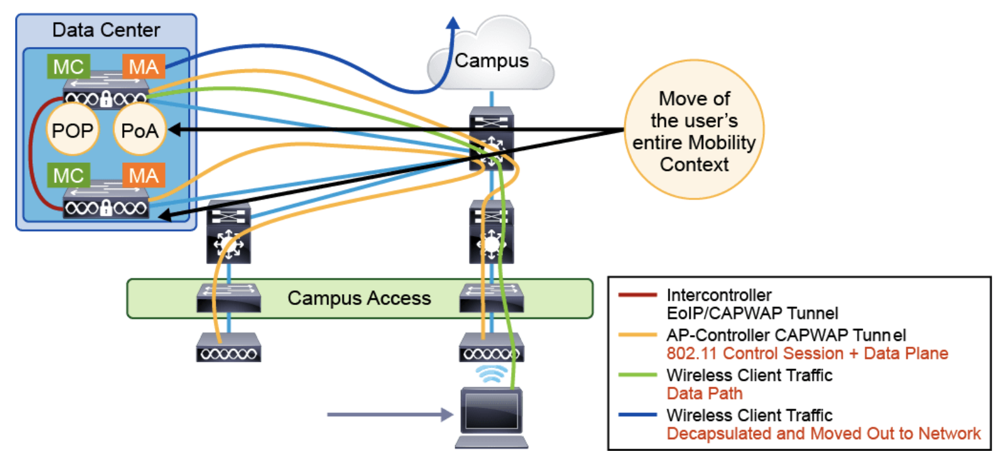

    - L3
      - ```Pre Roam```
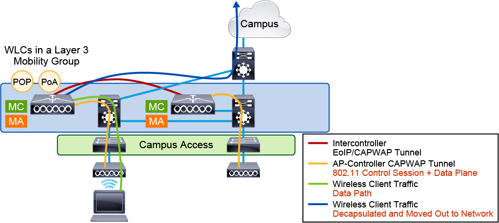

      - POP and PoA on the same WLC
      - User roams to AP on foreign WLC
      - New WLC exchanges mobility messages with original WLC and the client database entry copied ot new WLC
      - New security context and associations are established if necessary, and the client database entry is updated for the new AP.
      - The client PoA is moved to the new controller (foreign).
      - The client POP stays fixed to the original controller (anchor).
        - Note: this is done to ensure that the user retains the same IP address across a Layer 3 boundary roam and also to ensure continuity of policy application during roaming.
      - The client traffic is tunneled back to the original controller (anchor). This is called symmetric mobility tunneling.
- Auto-Anchor mobility (Guest access)
  - mobility group subset that anchost all WLAN traffic to a predeifned WLC(s)
  - Limits guest access to the corp netwokr via putting them in a DMZ
  - Allow geographihc access policy to a specific subnet regaless of client location
  - To change roaming charateristics, i.e if a firewall prevents L3 roaming from functioning.
  - The follwoing is the process
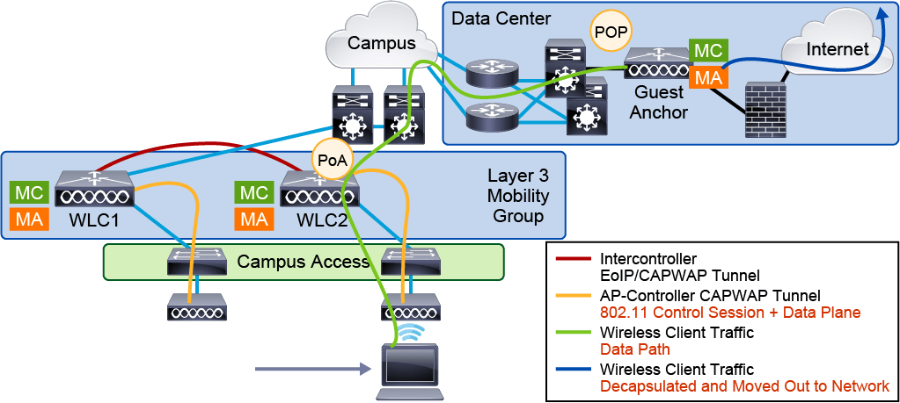

    - The wireless client associates to an AP on WLC1 on a guest SSID.
    - The guest user PoA will be with WLC1 that it associated through.
    - WLC1 will be pointed to the guest anchor for the guest SSID.
    - The guest user traffic will be tunneled to the guest anchor WLC at the top. (Remember that this symmetric tunnel will be EoIP or CAPWAP.)
    - The guest user IP will come from the guest anchor.
    - The guest anchor becomes the POP for the guest and will stay static.
    - The guest, once authenticated (assume WebAuth on the guest anchor), will have its traffic de-encapsulated at the anchor WLC and moved out to the network (to the firewall and then to the Internet).
    - The wireless client roams to an AP on WLC2. (WLC2 points to the same guest SSID on the guest anchor.)
    - The guest user PoA is now with WLC2.
    - The guest user POP is still with the guest anchor.
    - The guest user traffic will be tunneled from WLC2 to the guest anchor WLC.

:

- Location Services (used to perform network analytics)
  - Network analytics
    - Does the netowkr need more bandwidth
    - Can the login porcess be streamlines by using socila netowkr creds
    - How much time to cuosmters spend on the network
    - Where do people go on the network
    - What is important to the cusomter, produc info, inventory, ease of checkout, else?
    - CAn the netoewkr proivde different sever for best cusomters?
    - Is the network secure?
  ```
  How do you determine if the user experience in your network is good? You have to measure it. In the process of measuring, you extract information from various sources and may uncover patterns that may not have been evident by just looking at the amount of incoming and outgoing data. At a basic level, you observe the types of applications that are being used more frequently. Also, you observe where customers, visitors, and employees are spending their time in your facility, and how much time they are spending in your facility. Without analytics, you lack the context to grow your organization.
  ```
  - Cisco CMX (Cisco Connected Mobile Experiences)
    - leveraged analytics to understand mobile device patterns.
      - Detect
        - presence or location-based detection using the Wi-Fi signal
        - Presence is for smaller locations where you may only have one or two APs
        - Location-based detection depends on the type and number of APs that you have in your venue.
        -  location accuracy from 10 m all the way down to 1 m of accuracy.
          - 1 m of accuracy is based on the Cisco access points with the Hyperlocation module and antenna array attached
        - Bluetooth low energy (BLE) detection also, which requires BLE module
      - Connect
        - customized portal for guests to log in to the network.
        - authenticate the guest by using a social media account
      - Enagage
        - provide content to the guests
        - recurring guest, you may send a coupon of some type
    - On prem or cloud based deloyment
    - Precence analytics:
      - counting devices
      - Number of visitors versus passers-by and the conversion rate from passer-by to visitor
    - Location analytics:
      - heatmap visuals or playback over time
      - track the movement of guests through the venue
    - Location accuracy
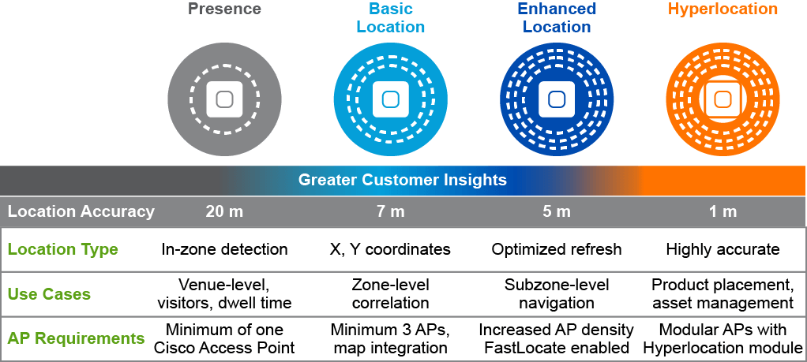


        - At least three APs must be used with no less than –75dBm signal strength on the same floor or level
        - good general principle is one AP per 2500 square feet for best performance
        - APs should be installed along the perimeter walls
        - stagger the APs so you cover the perimeter, and try to design so that at least four APs are within line of sight of the clients.
        - 20 percent cell overlap for optimized roaming and location calculations.

## AP operation <a name="APoperation"></a>

- Universal AP priming
  - Where APs can switch between regulatory domains (UK/US/DE..)
  - Manual priming:
    - Uses phone app, phone joins same WPA2-PSK SSID, AP detects phones geo and sets domain
    - Once one AP is primed, the other universal AP's can be primed automaticlla via NDP
      - NDP (Neighbor Discovery Protocol)
  - Automatic priming
    - A primed AP uses NDP to prime other universal AP's
      - Primed AP sends out reg domain is secure encrtpyted IEEE802.11 beacon frame
- Controller Discovery Process (in the AP's prefered order)
  - Subnet Broadcast
     - AP sends CAPWAP controller discovery broadcast packets
     - Any WLC hearing this will respond
  - Locally Stored
    - If AP was prev associated to a WLC these IPs are in APs NVRAM
    - AP may have a IP that pertains to sevral WLC in a mobilty group (using this will learn all group memebers)
  - DHCP
    - o43 for IPv4 of o52 for Ipv6 in DHCP with list of WLC IP address
       - Type: 0xf1
       - Number of WLC IPs * 4 (1 = 04, 3 = C0)
       - IPS of WLCs in hec: 192.168.10.5 = c0a80a14 : 192.168.6.2 = C0A80602
        - 043 == f104 c0a80a14
    - AP use these IP's to send unicast CAPWAP discovey probe
  - DNS
    - If DHCP set to give o6 (DNS server address) & o15 (Domain name)
    - AP looks to reslive "CISCO-CAPWAP-CONTROLLER.{localdomain}
- AP join order (once it has a list of all WLC from the CAPWAP discovery process)
  - The AP will associate first with its primary controller, assuming it has been established.
  - Upon failing with the primary, it will try to associate with its secondary.
  - Upon failing with the secondary, it will try to associate with its tertiary.
  - If there is no controller information established in the AP, the AP will then look for a master controller.
    - The master controller is an option on the WLC which is typically used to initialize a new AP for later deployment.
  - Finally, if there is no established controller and no master controller (i.e used LAN boracsast and found multie WLCs), the AP will select the least-loaded controller, which is defined as the controller with the greatest available AP capacity.
    - The load is a relative value. A 50-AP controller having 10 APs are considered as less loaded (20 percent) than a 6-AP controller having 3 APs (50 percent load).
- AP failover


  - AP's maintain a list of backup controller they can fail to that they perodically probe every 120s
  - APs fail either:
    - Per AP config (primary,secondary, tertiary)
    - WLC config of global and backup controller
    - If the Primry,secondary,tertiary, WCL primary or backups not avialiby, AP will to CAPWAP to find least loaded WLC
  - Failover priortity (default is 1,low)
    - Low/Med/High/Crit = Priorty 1/2/3/4
    - If a higher priorty AP joins a loaded WLC, the WLC droppes lower prioty AP's
  - AP Fallback (on by default)
    - When enabled, AP will return to primary WLC when back online
      - Causes 12-30 seconds service iturrups while failover
    - If Primary WLC is unstable can cause AP falpping between Primary/next WLC so common to disable this (recomedation is to not)
- AP high availability:
  - Each AP is given a primary, secondary and tertiary WLC
    - Pro : predicatalbe, fastaer failvoer, fall back options
    - Pro : More flexible redundancy design options (1:1, N:1, N:N:1)
    - Con : Statless redundnacy (no SSO), more upfron planning and config needed
  - N+1 WLC HA:
    - Single backup WLC for multiple priary WLC's
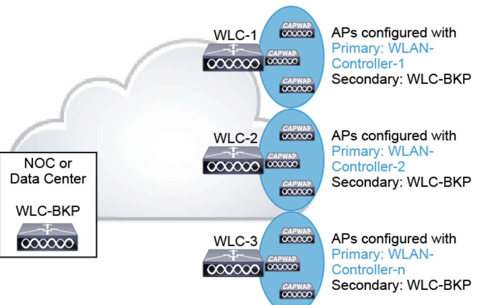

    - All WLC are independant and dont share config or IP addresses
    - EAch WLC managed seperatly
    - On failure, high priority AP's get priotiy on the backup WLC
    - N+1 Best practises:
      - Use with redundant WLC in sperate geo location
      - Config HA params to detec failure faster (min 30 sec global WLC params)
      - Use AP prioity in case of oversubscription (not enough lic) in redundunt WLC
      - Use the HA SKU, so can use more AP, eg a 5508 with 50-AP count lic confiugred as HA SKU secondary can support 500 AP's.
  - AP SSO HA
    - This is 1:1 (active/standby-hot) SSO
    - two WLC need L2 connectivity over the RP (Redundant POrt)
      - RP used config, operatinal data sync & role negotiation.
    - During AP SSO between the WLC's all session statefully swithc over
      - All clients are deauthenticated and reassociated with the new acitve controller
      - clients only passed over that have passed auth and DHCP already
      - Zero cleint downtime and no SSID outages.
    - the WLC pais share the same config (inc IP address)
    - no preepemtion in SSO
    - in bootup the WLC with the HA SKU will boot as hot-standby.
    - the HA SKU allows sharing of licnecs with the non HA SKU WLC.
    - AP SSO with secondary and tertiary design:
      - Two WLC in SSO (primary WLC) plus tow independanc WLC for the other roles
- AP modes:
  - Local mode "Centrally swithced"
    - This is the default mode
    - tunnels mgmt/data traffic to the WLC
    - Allows monitoring of all channels simultaneously
      - Used for RRM and rouge detection
  - Flex connect (FX) (AP in a branch or remote location away from the WLC)
    - Client auth can be local or central (regardless of mode)
    - Locally swithced:
      - AP Control and MGMT traffic sent CAPWAP to the WLC
      - Data traffic sithced locally,
        - WLC is mapped to 8021q trunk (can map multiple SSID to same VLAN)
      - CAn also have centrally swithced WLANS the CAPWAP to the WLC as well
    - Centrally switched:
      - Both MGMT and Data sent to the WLC
    - FX connected mode
      - CAPWAP to the WLC is up
      - Central auth, central switch:
        - Uses WLC for auth, unnles all data also to the WLC
        - works only in connected mode
      - Central auth, local switch:
        - Uses WLC for auth, all data trafic swithced locally
        - works only in connected mode
      - local auth, local switch:
        - Lcoal auth for WLANs that are open, PSK or 8021x (locall radius)
        - User traffic swihtced locally
        - Works in connected and standalone mode AP
    - FX Standalone mode
      - When CAPWAP control plane is not up (no reach WLC)
      - this mode will disassociates all clients that use centrally switched WLAN
      - any "local auth, local switch" connected clients will work untill roam or sessions time out.
      - WLANs using weauth stay up, no new cleintes allowed, if all webauth cleintes drop the AP will not beacon the webauth WLAN
      - Auth down, Central swithcing down:
        - No connection to the WLC
        - Central swihtced WLCAN no loger becon or respond
        - Clients are disassoiated
      - Auth down, local switching:
        - Central auth WLAN reject new users
        - Exsiting users stay connected untill time-out
        - WLAN beaocns and reply probes untill there are no ore usrs associated to WLAN.
      - Local auth, local switching:
        - Uses open, PSK or 8021x (lcoal radius)
        - WLAN will becond and respond to probes
        - Users remain connected
        - New users are accepted
  - Bridge Mode:
    - P2P or P2MP
      - Allows connecitng AP's together in a L2 domain
      - If the hub AP goes down, all spokes are isolated
    - Wireless Mesh
      - Needs a WLC
      - AP's with wired connection to the WLC are cllaed RAP (Root AP's)
      - APs netween the RAP are MAP (Mesh APs)
      - Uses one radio for backhaul between the Mesh and one for client data
      - Uses AWPP (Adaptive Wireless Path Protocol) to find best path though the mesh
        - AWPP uses not the shortest path, but the one with best ease (SNR and hop value of neighbors)
  - OEAP (Office Enxtended AP) mode:
    - special FX mode for teleworkers that uses split tunnling for intgernet/corporate
    - Can be used by non coorate deivces to, so good as a home router for all
  - AP monitor mode:
    - Act as dedicated sensors for Route AP detection, IDS, claotion based servvices
  - AP Route detector mode:
    - Radio is off, it just listens to wired traffic
    - Listens for APRs on the wire and Caches them
      - Cache used to determine if L2 address is a rouge clinet or AP on the wire.
  - AP Sniffer mode:
    - promiscuous mode to capture all IEEE 802.11 transmissions that it recieves
    - Info on timing, signal strenght are FWD to a remote analyser PC
  - AP SE-Connect mode:
    - SOMM (Spectrum-Only Monitor Mode)
    - Allows CleanAir AP to use as a sensor
    - Gathers info on the signal strength and duty cycles of RF transmissions wiht utualised bands
    - Data FWD to anaylset machine running MetaGeek Chanalyzer with CleanAir or Cisco Spectrum Expert for analysis

## Wireless Client Authentication <a name="WirelessClientAuthentication"></a>

- WEP (Weak and easily breakable)
- WPA/WPA2 frameworks (WPA2 deprecated WPA)
  - Enterprise mode (8021x)
    - Individual auth, auth managed devices and known users
    - Corporate use
    - 8021x port based access control
      - Supplicant : Device that want network access
      - Authenticator : Point of access (Switch, AP, WLC)
      - Authentication server : Machine that has conditions that allow access
      - Workflow:
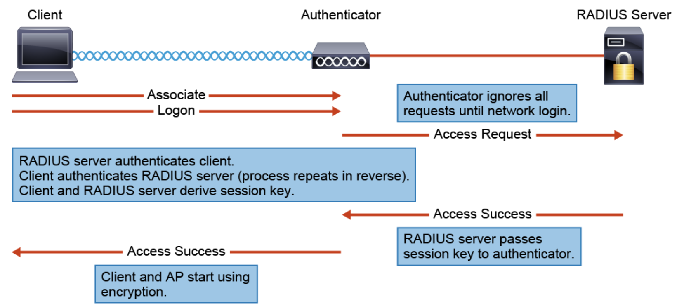

  - Personal mode (PSK)
    - Common auth, auths device not user, SOHO use
    - Use when no RADIUS server to use
    - Symmetrci encryption
    - Works at layers 1&2
    - Workflow:
      - The client sends an authentication request to the AP.
      - The AP sends a cleartext challenge phrase to the client.
      - The client encrypts the phrase with the shared key and sends it to the AP.
      - If the AP can decrypt the phrase with the key, then the AP sends an authentication to the client.
      - Once authenticated, the client makes an association request.
      - The AP sends an association response.
      - A virtual port is opened and client data is now allowed.
      - Data is encrypted using the same key.
- Web Authentication
  - 8021x incapable deivces, or backup for 8021x
  - Guest user acccess without need to provide support
- WPS (Wi-Fi Protected Setup)
  - Uses push button auto setup
  - Recomdaton to not use as has known weaknesses
- EAP (Extensible Auhtenction Protcol)
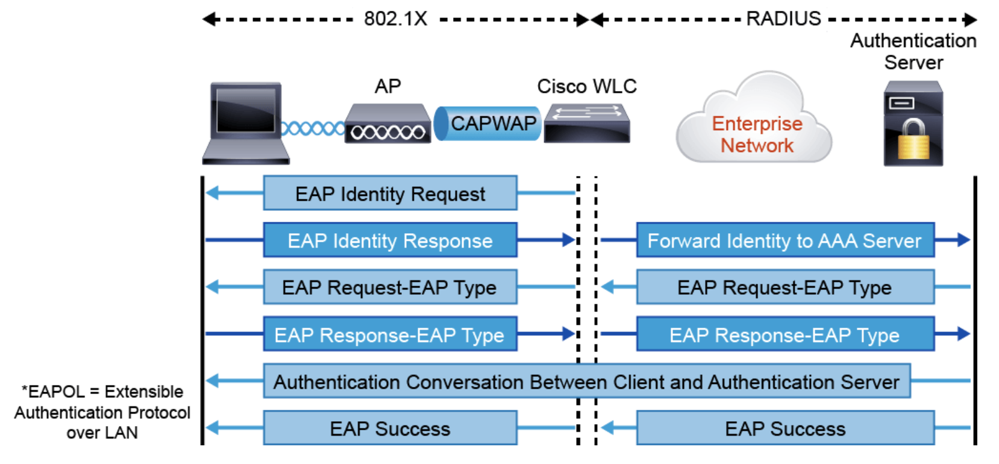

  - Defines auth process, steps and headers, not the type
  - Four message types (Request, response, success, failure)
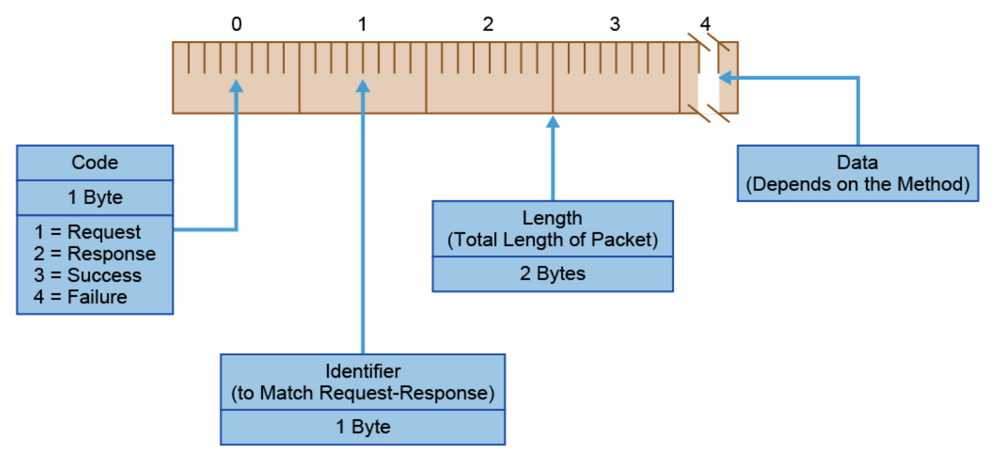

  - EAP is an auth protocol decoupled form the transport, so it can use:
    - 8021x/Radius to carry EAP that carries the auth
      - where 8021x blocks the port untill EAP auth it
    - EAPOL using the LAN MAC over 8021x
  - Has many flovours (40):

| EAP Types | EAP-TLS | PEAP | EAP-FAST | EAP-TTLS | LEAP |
| --- | --- | --- | --- | --- | --- |
| Mutual authentication | Yes | Yes | Yes | Yes | Yes |
| Client certificate required | Yes | No | No | No | No |
| Server certificate required | Yes | Yes | Optional | Yes | No |
| Deployment difficulty | Difficult | Moderate | Moderate | Moderate | Moderate |
| Wi-Fi security | Very high | High | High | High | Medium |
| Provider | Microsoft | Microsoft | Cisco | Funk | Cisco |
| Rogue AP detection | No | No | Yes | No | No

  - EAP-TLS:
    - Requires PKI and certs on clinets and auth server
    - Certs exchange, allowing an secure channel to use for authC
    - Wifi uses 8021x with open association auth to use EAP-TLS
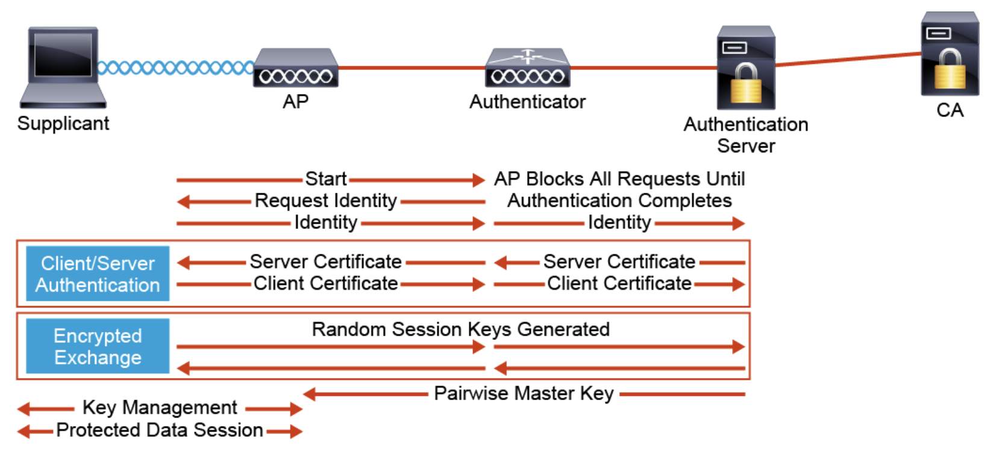

    - Once authed, a symetic key (Master key, session key, PMK) is genreated for bulk data between client and AP
      - As the aysmetic keys using in PKI are CPIU intesive, and are for server/clienttalk, not CLient AP
  - PEAP:
    - Requires server side cert only.
    - PEAP still creates a secure Cleint-server tunnel, and looks like EAP-TLS
      - CLeint sends fake cleint ID to the server (as opposed to a clear text username),
      - server sends back cert, cleint then sends the master encryption key using the public server cert. (phase 1)
      - witin this tunnel, the second authentication phase takes place. (phase 2)
      - phase 2 is the EAP auth for the client, witin the encrypted tunnel.
      - if successs a session key (PMK) is generated to use for bulk encryption, betwwen the client and the AP.
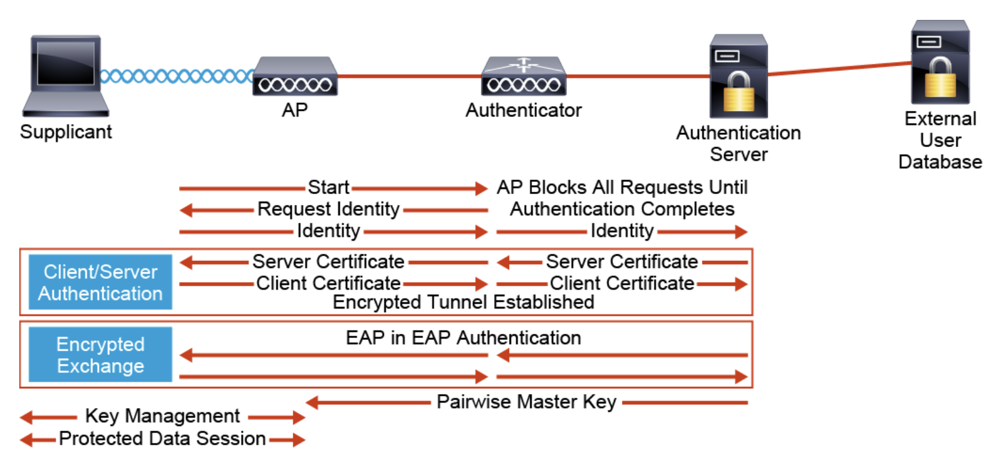

    - PEAP-GTC : (Genric tokekn card) can virtully any ID store OTP, token server, LDAP, e-directory...
    - PEAP-MSCHAPv2 : Auths to databases suporitng MS-Chap, inc Micrsoft AD
  - EAP-FAST:
    - No certs used.
    - Uses a unique shared PAC (Protecrted Access Credential) genrated on the auth server to mutally aith the cleinten and server.
    - Has three phases:
      - 0: Create PAC thats specfic to user ID and server authority (A-ID) and is intalled on the client (manually of via a trusted connection (TLS, MS-CHAP pasword based))
      - 1 : Establish a secure tunnel use PAC (similar to TLS) (PAC uses in place of PKI certs of priv/pub keys) to createa a tunnel key for phase 2.
      - 2 : RADIUS server auths the users creds that are passed in the tunnel.
    - PAC parts:
      - PAC Key : Cleint uses 32-Octet key to form phase 1 EAP-FAST tunnel, its mapped as a TLS premaster secret & the AAA server rerandomly genrates the PAC key.
      - PAC-Opaque : Valiralbe lenght field, used by server to valida the cleint ID
      - PAC-info : varaible length field prvodes : A-ID or PAC issuer, PACK-key lifetime.
    - PAC creation:
      - A server A-ID maintains a local key (master key), which only the server knows.
      - When a client identity, sometimes referred to as the I-ID, requests a PAC from the server, the server generates a randomly unique PAC key and PAC-Opaque field for this client.
      - The PAC-Opaque field contains the randomly generated PAC key, along with other information such as the I-ID and key lifetime.
      - The PAC-Opaque field is encrypted with the master key.
      - A PAC-Info field, which contains the A-ID, is also created.
    - PAC exchange:
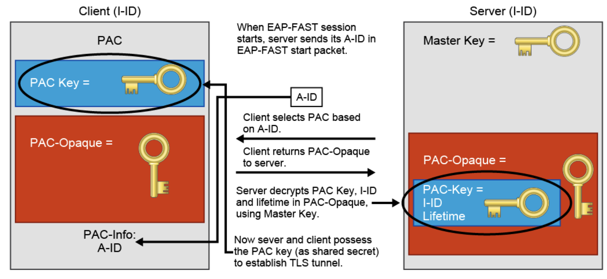
      - Inital PAC creatin need to be sent to the cleint during phase 0 provsions, or during a refresh in phase 2. Or manually installed on the client.
      - When an EAP-FAST session is initiated, the server sends its A-ID in an EAP-FAST start packet to the client.
        - One PAC key per cleint, after creation the server forgets the PAC and relies on the master key.
      - The client uses the A-ID to choose the PAC to use for this session.
      - The client sends the PAC-Opaque field from the appropriate PAC to the server.
      - The server uses the master key to decrypt the PAC-Opaque field and retrieve the PAC key, I-ID, and PAC lifetime.
      - Now the server and the client have the PAC key, which is used as a shared secret to establish a TLS tunnel.
  - EAP-FAST authentication: 8021x and open-auth wifi until association phase (AP resircts traffic till auth passed)
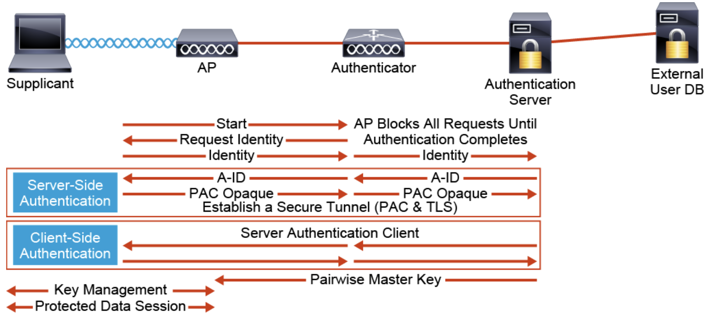

    - Client and AP agrees on 8021x and EAP
    - Cleint sends NAI addrss in email format
    - Server and client auth each other using pahse 1 and 2 (with PAC), result is same as EAP-TLS
  - Web Auth (guest access)
    - Redirects access requets to a HTTP server that can auth them and then push the VLAN/ACL to them
    - three areas needed:
      - Where guest path isolatin is : Local WCL, Auto-Anchor
      - Where the web auth portal is : Lcoal WLC, remote on external web server
      - Where users are defined : Lcoal on WLC, central guest accoud on RADIUS server
    - Local WLC web auth
      - Small buisness that provde guest
      - Use of VLAN that goes internet only
    - Local web auth with auto anchor
      - Auto-Anchor mobility (guest tunneling) that puts all guests in a single subnet anchored on a central anchor WLC
      - The local (Foreign) WLC provides the SSID and tunnels traffic to the anhor WLC
      - The Anchor WLC proivded, web auth page, local guest accouts, map wirelss to wired network
        - The guest associates to the local controller, and a local session is created.
        - A session (via a tunnel) is created to the Auto-Anchor WLC (session is per SSID, not client).
        - Packets from the client are encapsulated and sent through the tunnel to the Auto-Anchor WLC.
        - The Auto-Anchor WLC de-encapsulates the client packets and delivers them to the wired network
        - Traffic from the wired network to the client goes through the same tunnel.
    - Local web auth with external auth
      - Same as above two, where the portal page in on the local WLC, or Anchor if guest-tunneliing, but the crentials are passed from the WLC to a auth server to validate.
    - Central web auth
      - Web auth page and auth is done external to the WCL, such as on ISE.
      - Redirection done from the local or anchor WLC, depending on model uses (guest tunnel ro not)

- Configure 9800 WLC:
  - Tags: Tie WLC proifles/SSD and cleints/APs together (via adding AP's to the SSID)
    - APs tagges based on BCast domain and site it beligs to
  - Profiles: attrubutes applied to clients associated to an AP (part of the tags)

## Wireless Client Troubleshooting <a name="WirelessClientTroubleshooting"></a>

### Overall wireless <a name="Overallwireless"></a>

- Layer 1 = spectrum analysis
  - (MetaGeek Chanalyzer, Ekahau Site Survey, Cisco CleanAir, Cisco Spectrum Expert, and Cisco Meraki RF Spectrum)
- Layer 2 = Wi-Fi Scanning
  - (metageek Eye P.A, inSSIDer, Wi-Fi Analyzer, and Apple AirPort Utility.)
  - Glean Signal streaght of radio, AP channels used, SSID security)
- Layer 3 = Packat analysys
  - (metageek Eye P.A, Wireshark, omnipeek, airmagnet)
- WLC troubleshoot
  - AIROS
  ```
  config paging disable: to stop page breaks.

  debug client MAC address: It is a macro that enables eight debug commands, plus a filter on the MAC address that is provided

  show client summary: Shows client MAC, AP associated to, WLAN ID, and radio

  show client detail <mac>: Shows client username, associated AP, SSID, IP address, supported data rates, mobility state, security, and VLAN

  show client ap 802.11{a | b} cisco_ap: Shows the clients on a radio for an AP

  show client ap 802.11{a | b} all: Shows the clients on a radio for all APs

  show traplog: Shows the latest trap log information

  show logging: Shows the message log and current log severity level

  show 802.11{a | b}: Shows radio networking settings (status, rates, supported, power, and channel)

  show wlan <id>: Shows WLAN information (name, security, status, and all settings)

  show ap config 802.11{a | b} [summary] cisco_ap: Shows AP detailed configuration settings by radio

  show ap config general <apname>: Shows general AP configuration information

  show ap join stats summary all: Shows all APs joined (MAC, IP, name, and join status)

  show ap summary: Shows APs (model, MAC, IP address, country, and number of clients)

  show ap wlan 802.11{a | b} cisco_ap: Shows WLAN IDs, interfaces, and BSSID
  ```
  - Wireless LAN Controller Config Analyzer (WLCCA)
    - WLC config analyser online: https://cway.cisco.com/tools/WirelessAnalyzer/
      - "show run-config," “show tech," "show log” for AireOS
      - “show tech wireless” for 9800 IOS XE

### CLient connectivity <a name="CLientconnectivity"></a>
- Client to AP connectivity:
  - Antennas and RF Interference:
    - Antennas:
      - Use same type on an AP
      - Use max supported
      - positon all in same orientation
      - Antena spacing is a comprimse over effects
      - positin for about 1/2-1 wavelength apart
    - Inteferance:
      - cochannel like overlapping or oher deivces on same frenency
      - adjacent channel : APs to close to each other or have high power
  - AP Power (PoE)
    - Enough power at switch 802.3af = 15.4, 802.3at = 30w
  - Client Association with AP
    - Can be checked on the WLC (monitor->client->client MAC address)
- WLAN Configuration
  - Network-Side Issues (many users having issues)
    - Bad SSID spelling
    - SSID not enabled
    - Radio policy st to wrong band(s)
    - Interface groups incorrect (client gets IP in wrong subnet)
    - mismathced security
      - Inccorect AthC and encryption
      - Cleints cannot support the requried security
    - Raius not configured (8021x issues)
    - Radoi unsupported data rates : can set mandatory rates the a cleint may not support
  - Client-Side Issues (one or two users with issues)
    - Correct SSID?
    - Correct chanel 2.4 with wrong manaul channel set
    - Security
    - Do they get an IP, dhcp may be out
    - kerboard operator errors :from passwords
- Infrastructure Configuration:
  - VLAN/Trunk Configuration
    - MGMT VLAN + SSID VLANS
    - Correct native VLAN
    - Dynacic interfaces need be on differnt vlans and subnets
  - AP Association with Wireless LAN Controller
    - Discovery issues
      - AP gets IP via DHCP with option 43?
      - If use DNS is it up and has entry: CISCO-CAPWAP-CONTROLLER
      - WLC MGMT Interface is reachble by AP's
      - WCM module manamgnet interface (IOS-XE WLC) reahvble by AP's
    - Join issues
      - Valid certificates (can the WLC reach NTP and has correct date/time)
      - mismatched regulatory domains (AP must mathc WLC)
      - Firelwall blocking AP and CAPWAP?
      - Max Ap's reaahced (will seee Error message-dropping primary discovery request from AP XX:AA:BB:XX:DD: DD-maximum APs joined x/x)
  - Time Synchronization
    - NTP for WLC and ISE should be in sync
    - Correct timezones set
  - RF Groups
    - RF group size above capaciy (20 WLC)
    - spelling of group name on joining WLC?
    - No network path for hellos between the WLCs
  - Mobility Groups (clients not seamlessly roaming isses or group down)
    - Correct group name?
    - No network path between the WLCs
    - WLC MAC addresses correct for AirOS
    - Peer controll lin and data links status are not UP
  - Wireless LAN Controller Security Settings
    - Clients disalbed by WLAN admin (Security > AAA > Disable Clients)
    - Cleints excluded (Security > Wireless Protection Policies)
      - Excessive 802.11 association/authentication failures
      - Excessive 802.1x authentication failures
      - Excessive webauth failures
    - Client conenction exclusion timout confi via advanced tab.
      - Monitor Client will show status as "Excluded."

# Automation

- YANG
  - Used to describe data models

- HTTP status codes
  - 1XX : infomational
  - 2XX : Success
    - 200 : ok
    - 201 : created
    - 202 : Accepted
    - 204 : No content returned
  - 3XX : Redirections
  - 4XX : cinet error
    - 400 : bad request
    - 401 : incorrect password/Auth
    - 403 : understood, but forbidden
    - 404 : not found
  - 5XX : Server error
    - 500 : intenral server error
    - 502 : bad gateqay
    - 503 : service unavialbe

- Northbound southbound APIS:
  - North : REST API that exposes capabilites to the controller (the one you call into)
  - Intent API (On DNAC) use to sent from the controller to nodes to make changes

- Chrom timers
  - abcde
    - a = minute (0-59)
    - b = hour (0-23)
    - c = day of month (1-31)
    - d = month (1-12)
    - e = day of week (0-6) (0 = Sunday)
  - Examples
    - 1 0 * * * = 1 min past 0 every day
    - 0 23 * * * = 11pm every day


# Virtulisation and hypervisors
- tpyes of hypervisors
 - 1 : runs on bare metal
 - 2 : runs on top of an existing OS
 - 3 :


# SD-WAN <a name="SD-WAN"></a>


## A-SDW-START
- Objectives:
  - Describe the architecture and components of Cisco's SD-WAN solution, including vManage, vBond, vSmart Controllers, and WAN edge router
  - Describe the difference and functions of the control and data planes and the process used to activate each plane
  - Define the following terms and how they are used in SD-WAN: TLOC, Color, Site-ID, VPNs, Transport, and Service Sides
  - Locate the different workflows available in the vManage GUI including: Administration, Configuration, and Monitoring Tools
  - Describe the differences between the following deployment options and when each could be used: Cisco cloud delivered, partner delivered, and on premise
  - Describe how certificates are used to ensure secure connectivity between the vManage, vBond, vSmart Controllers, and WAN edge router and use vManage, to add a certificate to an SD-WAN device
  - Describe how the following protocols operate and are used in the SD-WAN implementation: NAT, BFD, and OMP.
  - Locate the OMP output details in vManage

- What is SD-WAN
  - Split the classical approach of three in-box components (I/O module, the control plane, switch backplane fabric) to be (Edges, vSmart & internet)
  - Centralised routing table within the controller (vSmart) thats disributed on demand to edges as policy mandates.
  - 

- vBond
  - Part fo the control plane, used for network discovery, its know as the orcastrator
  - Initiates the bring up process of every Edge device, at the first step it creates a secure tunnel with Edge's and informs vSmart and vManage about the edge parameters like for instance ip address.
  - Acts as STUN (Session traveral Utitling NAT), where is can map real to NAP IP..
    - **But the VBond needs to talk to the real IPs of all edges, outside of NAT**

- vManage
  - Front end to confiugre intnet on the vSmarts

- vSmart
  - this is the control plane of the system
  1. vSmart is the brain of the entire system.
  2. Works with vBond to authenticate devices as they join the network.
  3. Builds Control Plane connections with Edge using TLS.
  4. Orchestrate connectivity between Edges via the policies there by creating the network topology.
  5. Acts as a Route reflector by advertising the branches prefixes based on the policy.
  6. Shares the data plane keys of a Edges with other Edges based on the policy to allow them to build the tunnels – IKEless IPSEC.
  7. Policies are configured on vSmart.

- Internet
  - this is the backplane fabric for the I/O to talk to the controll plane

- (vc)Edge
  - These are the I/O modules for the packets in/out

- Authentication of devices 

[def]: #VitulisationTechniqies