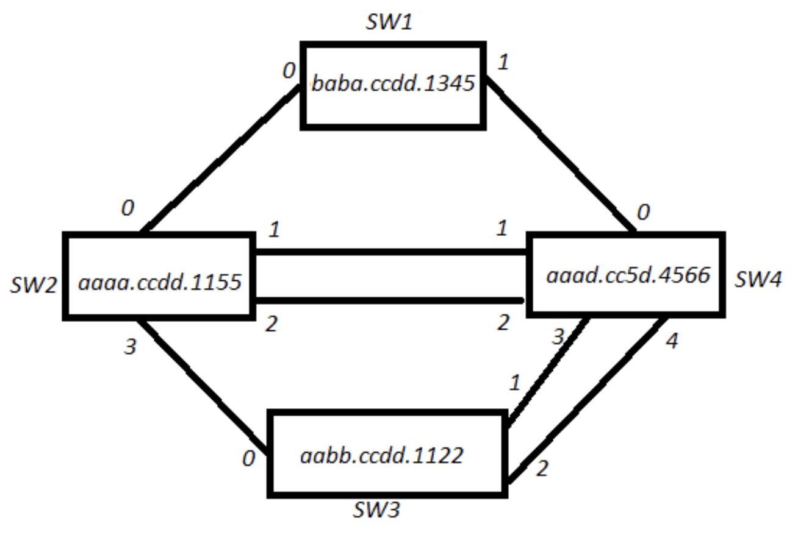

<!-- Google tag (gtag.js) -->

## Introduction
9th Dec 2016

Some questions to tickle you on STP, **click the text to reveal the  answers!**

## STP Question
**Given the topology below that is running 802.1D with all settings as default, please tell me:**

  
1a: What switch will be the Spanning-tree root bridge

SW2

  
1b: Why will this be the root bridge?

It has the lowest MAC address, when all priories tie, this is the tiebreaker

  
2a: What will be the BridgeID of all the BPDU's generated for VLAN 100?

32868

  
2b: What makes up this BridgeID value?

The BridgeID is the Priority+VLANID, where the default priority is 32768

  
3a: What ports on SW2 will be in the forwarding state?

All of them

  
3b: What will the forwarding port roles be?

all root bridge downstream ports are designated forwarding ports

  
4a: What port on SW4 will be the root port

Port 1

  
4b: Why will this be the root port?

Root port is the one with the lowest cost to reach the root bridge, is there is a tie then it’s the lowest received BPDU, if there is still a tie then it’s the lowest received port priority, if there is still a tie it’s the lowest local port ID (where port 1 = 1, 2  = 2, and so on). Therefore the tie breaker here is the local port ID

  
5a: On Switch 4, which ports will be designated ports?

(0, 3 & 4)

  
5b: Why will these be designated?

Designated Ports are calculated after Root Ports, of the two sides of the link they are calculated from the viewpoint of being on the link itself. Lets look at the SW1-Sw4 link. Here it’s a cost of 10 to reach the root via Sw1 or Sw4, therefore we look at the tiebreaker methods described in Q4a, the first item looks at the lowest BPDU where in this case SW4 has a lower one based on the MAC. Therefore SW4’s Port 0 is the DP & SW1’s Port 1 is the Alt blocked port

  
6a: What ports will be blocked in the topology?

SW1’s port 1, SW4’s Port 2 & SW3’s ports 1 & 2

  
6b: Why are these blocked?

All opposite sides to Designated ports that are not Root facing Ports are set to Alternate Blocked ports, this is to stop loops

 

How did you do?