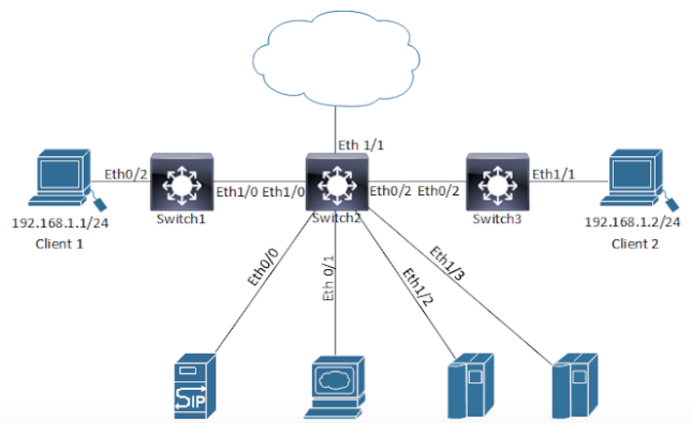

<!-- Google tag (gtag.js) -->
<script async src="https://www.googletagmanager.com/gtag/js?id=G-XKHR6PXZ9V"></script>
<script>
  window.dataLayer = window.dataLayer || [];
  function gtag(){dataLayer.push(arguments);}
  gtag('js', new Date());

  gtag('config', 'G-XKHR6PXZ9V');
</script>

# Contents:
- [Diagnostics Question](#diagnostics-question-)
  - [Reported issue](#reported-issue-)
    - [Initial Pings](#initial-pings-)
      - [Client 1](#client-1-)
      - [Client 2](#client-2-)
  - [Show Command outputs](#show-command-outputs-)
    - [Switch 1](#switch-1-)
      - [S1 show run](#s1-show-run-)
      - [S1 show vtp status](#s1-show-vtp-status-)
      - [S1 Show vlan](#s1-show-vlan-)
      - [S1 show spanning-tree](#s1-show-spanning-tree-)
    - [Switch 2](#switch-2-)
      - [S2 show run](#s2-show-run-)
      - [S2 show vtp status](#s2-show-vtp-status-)
      - [S2 Show log](#s2-show-log-)
    - [Switch 3](#switch-3-)
      - [S3 Show run](#s3-show-run-)
      - [S3 Show vtp status](#s3-show-vtp-status-)
      - [S3 Show vlan](#s3-show-vlan-)
- [Solution](#solution-)

# Diagnostics Question <a name="diagnostics-question"></a>
December 14 2016

Your job is to diagnose & locate the source of the problem, please post your comments below & I will follow this up with a post detailing the solution in due course.

The following is the topology for BlogTown's new network that has just been installed. It is made up of three multilayer switches. The core switch 'Switch 2'  provides layer three access to various services, such as the Internet & internal servers.

The two clients that connected to Switch 1 & Switch 3 are both in the same VLAN & subnet '192.168.1.0/24'




## Reported issue <a name="reported-issue"></a>
The users of the clients have complained that they cannot communicate directly with one another, but they can reach thier local IP hateways

Troubleshooting already completed:
Ping tests were run from both client PC's to test reachability. Following this a second ping test was run to see if either client could reach the Internet facing port Eth1/1 on Switch 2, results can be seen below in the log file 'Initial Pings".

Further Information Requested:
To help isolate the fault the following items were asked for & can be seen below:

- "show run" from all three switches
- "show vtp status" from all three switches
- "show vlan" from switches 1 & 3
- "show spanning-tree" from switch 1
- "show log" from switch 2

### Initial Pings <a name="initial-pings"></a>
#### Client 1 <a name="client-1"></a>
```
!!!Ping Swithc 1 SVI gateway for Client 1
CLIENT1#ping 192.168.1.1
Type escape sequence to abort.
Sending 5, 100-byte ICMP Echos to 192.168.1.1, timeout is 2 seconds:
!!!!!
Success rate is 100 percent (5/5), round-trip min/avg/max = 5/5/5 ms

!!!Ping Client 2 IP
CLIENT1#ping 192.168.1.2
Type escape sequence to abort.
Sending 5, 100-byte ICMP Echos to 192.168.1.2, timeout is 2 seconds:
.....
Success rate is 0 percent (0/5)

!!!Ping Switch 2 Eth 1/1 WAN interface
CLIENT1#ping 192.168.255.2
Type escape sequence to abort.
Sending 5, 100-byte ICMP Echos to 192.168.255.2, timeout is 2 seconds:
!!!!!
Success rate is 100 percent (5/5), round-trip min/avg/max = 1/1/1 ms
```


#### Client 2 <a name="client-2"></a>
```
!!!Ping my own IP address
CLIENT2#ping 192.168.1.2
Type escape sequence to abort.
Sending 5, 100-byte ICMP Echos to 192.168.1.2, timeout is 2 seconds:
!!!!!
Success rate is 100 percent (5/5), round-trip min/avg/max = 4/4/5 ms

!!!Ping Client 1 IP
CLIENT2#ping 192.168.1.1
Type escape sequence to abort.
Sending 5, 100-byte ICMP Echos to 192.168.1.1, timeout is 2 seconds:
.....
Success rate is 0 percent (0/5)

!!!Ping Switch 2 Eth 1/1 WAN interface
CLIENT2#ping 192.168.255.2
Type escape sequence to abort.
Sending 5, 100-byte ICMP Echos to 192.168.255.2, timeout is 2 seconds:
!!!!!
Success rate is 100 percent (5/5), round-trip min/avg/max = 1/1/1 ms
```

## Show Command outputs <a name="show-command-outputs"></a>
### Switch 1 <a name="switch-1"></a>
#### S1 show run <a name="s1-show-run"></a>
```
SW1#show run
Building configuration...

Current configuration : 1469 bytes
!
! Last configuration change at 04:01:14 CST Sat Nov 5 2016
!
version 15.2
service timestamps debug datetime msec
service timestamps log datetime msec
no service password-encryption
service compress-config
!
hostname SW1
!
boot-start-marker
boot-end-marker
!
!
enable password cisco
!
no aaa new-model
clock timezone CST -6 0
!
!
!
!
!
!
!
!
no ip domain-lookup
ip cef
ipv6 multicast rpf use-bgp
no ipv6 cef
!
!
spanning-tree mode pvst
spanning-tree extend system-id
!
!
!
!
!
!
!
!
!
!
!
!
!
!
interface Ethernet0/0
 switchport mode dynamic desirable
 shutdown
!
interface Ethernet0/1
 switchport mode dynamic desirable
 shutdown
!
interface Ethernet0/2
 switchport access vlan 1008
 switchport mode access
!
interface Ethernet0/3
 switchport mode dynamic desirable
 shutdown
!
interface Ethernet1/0
 switchport trunk encapsulation dot1q
 switchport mode trunk
!
interface Ethernet1/1
 switchport mode dynamic desirable
 shutdown
!
interface Ethernet1/2
 switchport mode dynamic desirable
 shutdown
!
interface Ethernet1/3
 switchport mode dynamic desirable
 shutdown
!
interface Vlan1
 ip address 192.168.0.1 255.255.255.0
 ip ospf 1 area 0
!
interface Vlan1008
 ip address 192.168.1.11 255.255.255.0
 ip ospf 1 area 0
!
router ospf 1
!
ip forward-protocol nd
!
no ip http server
no ip http secure-server
!
!
!
!
!
!
control-plane
!
!
line con 0
 logging synchronous
line aux 0
line vty 0 4
 password cisco
 login
!
!
end
```

#### S1 show vtp status <a name="s1-show-vtp-status"></a>
```
SW1#show vtp status
VTP Version capable             : 1 to 3
VTP version running             : 3
VTP Domain Name                 : CISCO
VTP Pruning Mode                : Disabled
VTP Traps Generation            : Disabled
Device ID                       : aabb.cc00.6500

Feature VLAN:
--------------
VTP Operating Mode                : Primary Server
Number of existing VLANs          : 9
Number of existing extended VLANs : 1
Maximum VLANs supported locally   : 4096
Configuration Revision            : 4
Primary ID                        : aabb.cc00.6500
Primary Description               : SW1
MD5 digest                        : 0xE5 0x6D 0x8F 0x0B 0x12 0x2E 0xF7 0xF1
                                    0x48 0xE9 0xF6 0x57 0x27 0x93 0x1E 0xB4


Feature MST:
--------------
VTP Operating Mode                : Transparent


Feature UNKNOWN:
--------------
VTP Operating Mode                : Transparent

```

#### S1 Show vlan <a name="s1-show-vlan"></a>
```

SW1#show vlan
VLAN Name                             Status    Ports
---- -------------------------------- --------- -------------------------------
1    default                          active    Et0/0, Et0/1, Et0/3, Et1/1
                                                Et1/2, Et1/3
2    VLAN0002                         active
5    VLAN0005                         active
55   VLAN0055                         active
66   VLAN0066                         active
1002 fddi-default                     act/unsup
1003 trcrf-default                    act/unsup
1004 fddinet-default                  act/unsup
1005 trbrf-default                    act/unsup
1008 VLAN1008                         active    Et0/2

VLAN Type  SAID       MTU   Parent RingNo BridgeNo Stp  BrdgMode Trans1 Trans2
---- ----- ---------- ----- ------ ------ -------- ---- -------- ------ ------
1    enet  100001     1500  -      -      -        -    -        0      0
2    enet  100002     1500  -      -      -        -    -        0      0
5    enet  100005     1500  -      -      -        -    -        0      0
55   enet  100055     1500  -      -      -        -    -        0      0
66   enet  100066     1500  -      -      -        -    -        0      0
1002 fddi  101002     1500  -      -      -        -    -        0      0

VLAN Type  SAID       MTU   Parent RingNo BridgeNo Stp  BrdgMode Trans1 Trans2
---- ----- ---------- ----- ------ ------ -------- ---- -------- ------ ------
1003 trcrf 101003     4472  1005   3276   -        -    srb      0      0
1004 fdnet 101004     1500  -      -      -        ieee -        0      0
1005 trbrf 101005     4472  -      -      15       ibm  -        0      0
1008 enet  101008     1500  -      -      -        -    -        0      0


VLAN AREHops STEHops Backup CRF
---- ------- ------- ----------
1003 7       7       off

Primary Secondary Type              Ports
------- --------- ----------------- ------------------------------------------

```

#### S1 show spanning-tree <a name="s1-show-spanning-tree"></a>
```

SW1#show spanning-tree
VLAN0001
  Spanning tree enabled protocol ieee
  Root ID    Priority    32769
             Address     aabb.cc00.6500
             This bridge is the root
             Hello Time   2 sec  Max Age 20 sec  Forward Delay 15 sec

  Bridge ID  Priority    32769  (priority 32768 sys-id-ext 1)
             Address     aabb.cc00.6500
             Hello Time   2 sec  Max Age 20 sec  Forward Delay 15 sec
             Aging Time  300 sec

Interface           Role Sts Cost      Prio.Nbr Type
------------------- ---- --- --------- -------- --------------------------------
Et1/0               Desg FWD 100       128.5    Shr


VLAN0002
  Spanning tree enabled protocol ieee
  Root ID    Priority    32770
             Address     aabb.cc00.6500
             This bridge is the root
             Hello Time   2 sec  Max Age 20 sec  Forward Delay 15 sec

  Bridge ID  Priority    32770  (priority 32768 sys-id-ext 2)
             Address     aabb.cc00.6500
             Hello Time   2 sec  Max Age 20 sec  Forward Delay 15 sec
             Aging Time  300 sec

Interface           Role Sts Cost      Prio.Nbr Type
------------------- ---- --- --------- -------- --------------------------------
Et1/0               Desg FWD 100       128.5    Shr


VLAN0005
  Spanning tree enabled protocol ieee
  Root ID    Priority    32773
             Address     aabb.cc00.6500
             This bridge is the root
             Hello Time   2 sec  Max Age 20 sec  Forward Delay 15 sec

  Bridge ID  Priority    32773  (priority 32768 sys-id-ext 5)
             Address     aabb.cc00.6500
             Hello Time   2 sec  Max Age 20 sec  Forward Delay 15 sec
             Aging Time  300 sec

Interface           Role Sts Cost      Prio.Nbr Type
------------------- ---- --- --------- -------- --------------------------------
Et1/0               Desg FWD 100       128.5    Shr


VLAN0055
  Spanning tree enabled protocol ieee
  Root ID    Priority    32823
             Address     aabb.cc00.6500
             This bridge is the root
             Hello Time   2 sec  Max Age 20 sec  Forward Delay 15 sec

  Bridge ID  Priority    32823  (priority 32768 sys-id-ext 55)
             Address     aabb.cc00.6500
             Hello Time   2 sec  Max Age 20 sec  Forward Delay 15 sec
             Aging Time  300 sec

Interface           Role Sts Cost      Prio.Nbr Type
------------------- ---- --- --------- -------- --------------------------------
Et1/0               Desg FWD 100       128.5    Shr


VLAN0066
  Spanning tree enabled protocol ieee
  Root ID    Priority    32834
             Address     aabb.cc00.6500
             This bridge is the root
             Hello Time   2 sec  Max Age 20 sec  Forward Delay 15 sec

  Bridge ID  Priority    32834  (priority 32768 sys-id-ext 66)
             Address     aabb.cc00.6500
             Hello Time   2 sec  Max Age 20 sec  Forward Delay 15 sec
             Aging Time  300 sec

Interface           Role Sts Cost      Prio.Nbr Type
------------------- ---- --- --------- -------- --------------------------------
Et1/0               Desg FWD 100       128.5    Shr


VLAN1008
  Spanning tree enabled protocol ieee
  Root ID    Priority    33776
             Address     aabb.cc00.6500
             This bridge is the root
             Hello Time   2 sec  Max Age 20 sec  Forward Delay 15 sec

  Bridge ID  Priority    33776  (priority 32768 sys-id-ext 1008)
             Address     aabb.cc00.6500
             Hello Time   2 sec  Max Age 20 sec  Forward Delay 15 sec
             Aging Time  300 sec

Interface           Role Sts Cost      Prio.Nbr Type
------------------- ---- --- --------- -------- --------------------------------
Et0/2               Desg FWD 100       128.3    Shr
Et1/0               Desg FWD 100       128.5    Shr

```

### Switch 2 <a name="switch-2"></a>
#### S2 show run <a name="s2-show-run"></a>
```
SW2#show run
Building configuration...

Current configuration : 1515 bytes
!
! Last configuration change at 04:03:56 CST Sat Nov 5 2016
!
version 15.2
service timestamps debug datetime msec
service timestamps log datetime msec
no service password-encryption
service compress-config
!
hostname SW2
!
boot-start-marker
boot-end-marker
!
!
enable password cisco
!
no aaa new-model
clock timezone CST -6 0
!
!
!
!
!
!
!
!
no ip domain-lookup
ip cef
ipv6 multicast rpf use-bgp
no ipv6 cef
!
!
spanning-tree mode pvst
spanning-tree extend system-id
!
vlan internal allocation policy ascending
!
!
!
!
!
!
!
!
!
!
!
!
!
interface Ethernet0/0
 no switchport
 ip address 192.168.23.2 255.255.255.0
 duplex auto
!
interface Ethernet0/1
 no switchport
 ip address 192.168.24.2 255.255.255.0
 duplex auto
!
interface Ethernet0/2
 switchport trunk encapsulation dot1q
 switchport mode trunk
!
interface Ethernet0/3
 shutdown
!
interface Ethernet1/0
 switchport trunk encapsulation dot1q
 switchport mode trunk
!
interface Ethernet1/1
 no switchport
 ip address 192.168.255.2 255.255.255.0
 duplex auto
!
interface Ethernet1/2
 no switchport
 ip address 192.168.25.2 255.255.255.0
 duplex auto
!
interface Ethernet1/3
 no switchport
 ip address 192.168.26.2 255.255.255.0
 duplex auto
!
interface Vlan1
 ip address 192.168.0.2 255.255.255.0
 ip ospf 1 area 0
!
router ospf 1
 network 0.0.0.0 255.255.255.255 area 0
!
ip forward-protocol nd
!
no ip http server
no ip http secure-server
!
!
!
!
!
!
control-plane
!
!
line con 0
 logging synchronous
line aux 0
line vty 0 4
 password cisco
 login
!
!
end
```

#### S2 show vtp status <a name="s2-show-vtp-status"></a>
```
SW2#show vtp status
VTP Version capable             : 1 to 3
VTP version running             : 3
VTP Domain Name                 : CISCO
VTP Pruning Mode                : Disabled
VTP Traps Generation            : Disabled
Device ID                       : aabb.cc00.6600

Feature VLAN:
--------------
VTP Operating Mode                : Client
Number of existing VLANs          : 9
Number of existing extended VLANs : 0
Maximum VLANs supported locally   : 4096
Configuration Revision            : 4
Primary ID                        : aabb.cc00.6500
Primary Description               : SW1
MD5 digest                        : 0xE5 0x6D 0x8F 0x0B 0x12 0x2E 0xF7 0xF1
                                    0x48 0xE9 0xF6 0x57 0x27 0x93 0x1E 0xB4


Feature MST:
--------------
VTP Operating Mode                : Transparent


Feature UNKNOWN:
--------------
VTP Operating Mode                : Transparent
```

#### S2 Show log <a name="s2-show-log"></a>
```
*Nov  5 09:56:59.789: %LINEPROTO-5-UPDOWN: Line protocol on Interface Vlan1, changed state to down
*Nov  5 09:57:52.203: %LINK-3-UPDOWN: Interface Vlan1, changed state to up
*Nov  5 09:57:53.210: %LINEPROTO-5-UPDOWN: Line protocol on Interface Vlan1, changed state to up
*Nov  5 09:58:14.336: ICMP: echo reply sent, src 192.168.0.2, dst 192.168.0.1, topology BASE, dscp 0 topoid 0
*Nov  5 09:58:14.336: ICMP: echo reply sent, src 192.168.0.2, dst 192.168.0.1, topology BASE, dscp 0 topoid 0
*Nov  5 09:58:14.337: ICMP: echo reply sent, src 192.168.0.2, dst 192.168.0.1, topology BASE, dscp 0 topoid 0
*Nov  5 09:58:14.337: ICMP: echo reply sent, src 192.168.0.2, dst 192.168.0.1, topology BASE, dscp 0 topoid 0
*Nov  5 09:58:14.337: ICMP: echo reply sent, src 192.168.0.2, dst 192.168.0.1, topology BASE, dscp 0 topoid 0
*Nov  5 09:58:36.026: %OSPF-5-ADJCHG: Process 1, Nbr 192.168.0.1 on Vlan1 from LOADING to FULL, Loading Done
*Nov  5 09:58:39.008: %OSPF-5-ADJCHG: Process 1, Nbr 10.11.0.103 on Vlan1 from LOADING to FULL, Loading Done
*Nov  5 10:01:08.538: %LINK-5-CHANGED: Interface Loopback0, changed state to administratively down
*Nov  5 10:01:09.544: %LINEPROTO-5-UPDOWN: Line protocol on Interface Loopback0, changed state to down
*Nov  5 10:01:25.687: %SYS-5-CONFIG_I: Configured from console by console
*Nov  5 10:02:03.321: ICMP: echo reply sent, src 192.168.23.2, dst 192.168.1.1, topology BASE, dscp 0 topoid 0
*Nov  5 10:02:05.321: ICMP: echo reply sent, src 192.168.23.2, dst 192.168.1.1, topology BASE, dscp 0 topoid 0
*Nov  5 10:03:12.127: ICMP: echo reply sent, src 192.168.23.2, dst 192.168.1.1, topology BASE, dscp 0 topoid 0
*Nov  5 10:03:12.128: ICMP: echo reply sent, src 192.168.23.2, dst 192.168.1.1, topology BASE, dscp 0 topoid 0
*Nov  5 10:03:12.128: ICMP: echo reply sent, src 192.168.23.2, dst 192.168.1.1, topology BASE, dscp 0 topoid 0
*Nov  5 10:03:12.128: ICMP: echo reply sent, src 192.168.23.2, dst 192.168.1.1, topology BASE, dscp 0 topoid 0
*Nov  5 10:03:12.128: ICMP: echo reply sent, src 192.168.23.2, dst 192.168.1.1, topology BASE, dscp 0 topoid 0
*Nov  5 10:03:56.453: %SYS-5-CONFIG_I: Configured from console by console
*Nov  5 10:05:37.356: ICMP: echo reply sent, src 192.168.26.2, dst 192.168.1.1, topology BASE, dscp 0 topoid 0
*Nov  5 10:05:39.359: ICMP: echo reply sent, src 192.168.26.2, dst 192.168.1.1, topology BASE, dscp 0 topoid 0
*Nov  5 10:06:03.944: ICMP: echo reply sent, src 192.168.26.2, dst 192.168.1.2, topology BASE, dscp 0 topoid 0
*Nov  5 10:06:05.947: ICMP: echo reply sent, src 192.168.26.2, dst 192.168.1.2, topology BASE, dscp 0 topoid 0
*Nov  5 10:25:34.323: ICMP: echo reply sent, src 192.168.255.2, dst 192.168.1.1, topology BASE, dscp 0 topoid 0
*Nov  5 10:25:34.324: ICMP: echo reply sent, src 192.168.255.2, dst 192.168.1.1, topology BASE, dscp 0 topoid 0
*Nov  5 10:25:34.324: ICMP: echo reply sent, src 192.168.255.2, dst 192.168.1.1, topology BASE, dscp 0 topoid 0
*Nov  5 10:25:34.324: ICMP: echo reply sent, src 192.168.255.2, dst 192.168.1.1, topology BASE, dscp 0 topoid 0
*Nov  5 10:25:34.324: ICMP: echo reply sent, src 192.168.255.2, dst 192.168.1.1, topology BASE, dscp 0 topoid 0
*Nov  5 10:26:30.455: ICMP: echo reply sent, src 192.168.255.2, dst 192.168.1.2, topology BASE, dscp 0 topoid 0
*Nov  5 10:26:30.455: ICMP: echo reply sent, src 192.168.255.2, dst 192.168.1.2, topology BASE, dscp 0 topoid 0
*Nov  5 10:26:30.455: ICMP: echo reply sent, src 192.168.255.2, dst 192.168.1.2, topology BASE, dscp 0 topoid 0
*Nov  5 10:26:30.455: ICMP: echo reply sent, src 192.168.255.2, dst 192.168.1.2, topology BASE, dscp 0 topoid 0
*Nov  5 10:26:30.455: ICMP: echo reply sent, src 192.168.255.2, dst 192.168.1.2, topology BASE, dscp 0 topoid 0
*Nov  5 10:39:24.829: OSPF-1 ADJ   Et0/0: Rcv pkt from 192.168.24.2, area 0.0.0.0 : src not on the same network
*Nov  5 10:39:31.234: OSPF-1 ADJ   Et0/1: Rcv pkt from 192.168.23.2, area 0.0.0.0 : src not on the same network
*Nov  5 10:39:34.116: OSPF-1 ADJ   Et0/0: Rcv pkt from 192.168.24.2, area 0.0.0.0 : src not on the same network
*Nov  5 10:39:40.977: OSPF-1 ADJ   Et0/1: Rcv pkt from 192.168.23.2, area 0.0.0.0 : src not on the same network
*Nov  5 10:39:43.416: OSPF-1 ADJ   Et0/0: Rcv pkt from 192.168.24.2, area 0.0.0.0 : src not on the same network
*Nov  5 10:39:50.317: OSPF-1 ADJ   Et0/1: Rcv pkt from 192.168.23.2, area 0.0.0.0 : src not on the same network
*Nov  5 10:39:52.829: OSPF-1 ADJ   Et0/0: Rcv pkt from 192.168.24.2, area 0.0.0.0 : src not on the same network
*Nov  5 10:40:00.058: OSPF-1 ADJ   Et0/1: Rcv pkt from 192.168.23.2, area 0.0.0.0 : src not on the same network
*Nov  5 10:40:02.544: OSPF-1 ADJ   Et0/0: Rcv pkt from 192.168.24.2, area 0.0.0.0 : src not on the same network
*Nov  5 10:40:07.017: ICMP: echo reply sent, src 192.168.255.2, dst 192.168.1.2, topology BASE, dscp 0 topoid 0
*Nov  5 10:40:07.022: ICMP: echo reply sent, src 192.168.255.2, dst 192.168.1.2, topology BASE, dscp 0 topoid 0
*Nov  5 10:40:07.027: ICMP: echo reply sent, src 192.168.255.2, dst 192.168.1.2, topology BASE, dscp 0 topoid 0
*Nov  5 10:40:07.032: ICMP: echo reply sent, src 192.168.255.2, dst 192.168.1.2, topology BASE, dscp 0 topoid 0
*Nov  5 10:40:07.036: ICMP: echo reply sent, src 192.168.255.2, dst 192.168.1.2, topology BASE, dscp 0 topoid 0
*Nov  5 10:40:09.162: OSPF-1 ADJ   Et0/1: Rcv pkt from 192.168.23.2, area 0.0.0.0 : src not on the same network
*Nov  5 10:40:11.680: OSPF-1 ADJ   Vl1: 192.168.0.1 address 192.168.0.1 is dead
*Nov  5 10:40:11.680: OSPF-1 ADJ   Vl1: 192.168.0.1 address 192.168.0.1 is dead, state DOWN
*Nov  5 10:40:11.680: %OSPF-5-ADJCHG: Process 1, Nbr 192.168.0.1 on Vlan1 from FULL to DOWN, Neighbor Down: Dead timer expired
*Nov  5 10:40:11.680: OSPF-1 ADJ   Vl1: Neighbor change event
*Nov  5 10:40:11.680: OSPF-1 ADJ   Vl1: DR/BDR election
*Nov  5 10:40:11.680: OSPF-1 ADJ   Vl1: Elect BDR 10.11.0.103
*Nov  5 10:40:11.680: OSPF-1 ADJ   Vl1: Elect DR 10.11.0.103
*Nov  5 10:40:11.680: OSPF-1 ADJ   Vl1: DR: 10.11.0.103 (Id)
*Nov  5 10:40:11.680: OSPF-1 ADJ   Vl1:    BDR: 10.11.0.103 (Id)
*Nov  5 10:40:11.680: OSPF-1 ADJ   Vl1: Remember old DR 192.168.0.1 (id)
*Nov  5 10:40:12.126: OSPF-1 ADJ   Et0/0: Rcv pkt from 192.168.24.2, area 0.0.0.0 : src not on the same network
*Nov  5 10:40:17.911: OSPF-1 ADJ   Vl1: Neighbor change event
*Nov  5 10:40:17.911: OSPF-1 ADJ   Vl1: DR/BDR election
*Nov  5 10:40:17.911: OSPF-1 ADJ   Vl1: Elect BDR 10.11.0.102
*Nov  5 10:40:17.911: OSPF-1 ADJ   Vl1: Elect DR 10.11.0.103
*Nov  5 10:40:17.911: OSPF-1 ADJ   Vl1: Elect BDR 10.11.0.102
*Nov  5 10:40:17.911: OSPF-1 ADJ   Vl1: Elect DR 10.11.0.103
*Nov  5 10:40:17.911: OSPF-1 ADJ   Vl1: DR: 10.11.0.103 (Id)
*Nov  5 10:40:17.911: OSPF-1 ADJ   Vl1:    BDR: 10.11.0.102 (Id)
*Nov  5 10:40:17.911: OSPF-1 ADJ   Vl1: Neighbor change event
*Nov  5 10:40:17.911: OSPF-1 ADJ   Vl1: DR/BDR election
*Nov  5 10:40:17.911: OSPF-1 ADJ   Vl1: Elect BDR 10.11.0.102
*Nov  5 10:40:17.911: OSPF-1 ADJ   Vl1: Elect DR 10.11.0.103
*Nov  5 10:40:17.911: OSPF-1 ADJ   Vl1: DR: 10.11.0.103 (Id)
*Nov  5 10:40:17.911: OSPF-1 ADJ   Vl1:    BDR: 10.11.0.102 (Id)
*Nov  5 10:40:18.672: OSPF-1 ADJ   Et0/1: Rcv pkt from 192.168.23.2, area 0.0.0.0 : src not on the same network
*Nov  5 10:40:21.668: OSPF-1 ADJ   Et0/0: Rcv pkt from 192.168.24.2, area 0.0.0.0 : src not on the same network
*Nov  5 10:40:24.550: %PM-4-EXT_VLAN_INUSE: VLAN 1008 currently in use by Ethernet1/2
*Nov  5 10:40:24.550: %SW_VLAN-4-VLAN_CREATE_FAIL: Failed to create VLANs 1008: VLAN(s) not available in Port Manager
*Nov  5 10:40:28.125: OSPF-1 ADJ   Et0/1: Rcv pkt from 192.168.23.2, area 0.0.0.0 : src not on the same network
*Nov  5 10:40:31.354: OSPF-1 ADJ   Et0/0: Rcv pkt from 192.168.24.2, area 0.0.0.0 : src not on the same network
*Nov  5 10:40:36.754: OSPF-1 ADJ   Vl1: Rcv DBD from 192.168.0.1 seq 0x1FF1 opt 0x52 flag 0x7 len 32  mtu 1500 state INIT
*Nov  5 10:40:36.754: OSPF-1 ADJ   Vl1: 2 Way Communication to 192.168.0.1, state 2WAY
*Nov  5 10:40:36.754: OSPF-1 ADJ   Vl1: Neighbor change event
*Nov  5 10:40:36.754: OSPF-1 ADJ   Vl1: DR/BDR election
*Nov  5 10:40:36.754: OSPF-1 ADJ   Vl1: Elect BDR 10.11.0.102
*Nov  5 10:40:36.754: OSPF-1 ADJ   Vl1: Elect DR 10.11.0.103
*Nov  5 10:40:36.754: OSPF-1 ADJ   Vl1: DR: 10.11.0.103 (Id)
*Nov  5 10:40:36.754: OSPF-1 ADJ   Vl1:    BDR: 10.11.0.102 (Id)
*Nov  5 10:40:36.754: OSPF-1 ADJ   Vl1: Nbr 192.168.0.1: Prepare dbase exchange
*Nov  5 10:40:36.754: OSPF-1 ADJ   Vl1: Send DBD to 192.168.0.1 seq 0x334 opt 0x52 flag 0x7 len 32
*Nov  5 10:40:36.754: OSPF-1 ADJ   Vl1: NBR Negotiation Done. We are the SLAVE
*Nov  5 10:40:36.754: OSPF-1 ADJ   Vl1: Nbr 192.168.0.1: Summary list built, size 5
*Nov  5 10:40:36.754: OSPF-1 ADJ   Vl1: Send DBD to 192.168.0.1 seq 0x1FF1 opt 0x52 flag 0x2 len 132
*Nov  5 10:40:36.754: OSPF-1 ADJ   Vl1: Rcv DBD from 192.168.0.1 seq 0x1FF2 opt 0x52 flag 0x1 len 92  mtu 1500 state EXCHANGE
*Nov  5 10:40:36.754: OSPF-1 ADJ   Vl1: Exchange Done with 192.168.0.1
*Nov  5 10:40:36.754: OSPF-1 ADJ   Vl1: Send LS REQ to 192.168.0.1 length 36 LSA count 1
*Nov  5 10:40:36.754: OSPF-1 ADJ   Vl1: Send DBD to 192.168.0.1 seq 0x1FF2 opt 0x52 flag 0x0 len 32
*Nov  5 10:40:36.754: OSPF-1 ADJ   Vl1: Rcv LS UPD from 192.168.0.1 length 76 LSA count 1
*Nov  5 10:40:36.754: OSPF-1 ADJ   Vl1: Synchronized with 192.168.0.1, state FULL
*Nov  5 10:40:36.754: %OSPF-5-ADJCHG: Process 1, Nbr 192.168.0.1 on Vlan1 from LOADING to FULL, Loading Done
*Nov  5 10:40:36.754: OSPF-1 ADJ   Vl1: Rcv LS REQ from 192.168.0.1 length 72 LSA count 4
*Nov  5 10:40:37.243: ICMP: echo reply sent, src 192.168.255.2, dst 192.168.1.2, topology BASE, dscp 0 topoid 0
*Nov  5 10:40:37.244: ICMP: echo reply sent, src 192.168.255.2, dst 192.168.1.2, topology BASE, dscp 0 topoid 0
*Nov  5 10:40:37.244: ICMP: echo reply sent, src 192.168.255.2, dst 192.168.1.2, topology BASE, dscp 0 topoid 0
*Nov  5 10:40:37.244: ICMP: echo reply sent, src 192.168.255.2, dst 192.168.1.2, topology BASE, dscp 0 topoid 0
*Nov  5 10:40:37.244: ICMP: echo reply sent, src 192.168.255.2, dst 192.168.1.2, topology BASE, dscp 0 topoid 0
*Nov  5 10:40:37.394: OSPF-1 ADJ   Et0/1: Rcv pkt from 192.168.23.2, area 0.0.0.0 : src not on the same network
*Nov  5 10:40:40.621: OSPF-1 ADJ   Et0/0: Rcv pkt from 192.168.24.2, area 0.0.0.0 : src not on the same network
*Nov  5 10:40:41.452: OSPF-1 ADJ   Vl1: Neighbor change event
*Nov  5 10:40:41.452: OSPF-1 ADJ   Vl1: DR/BDR election
*Nov  5 10:40:41.452: OSPF-1 ADJ   Vl1: Elect BDR 10.11.0.102
*Nov  5 10:40:41.453: OSPF-1 ADJ   Vl1: Elect DR 10.11.0.103
*Nov  5 10:40:41.453: OSPF-1 ADJ   Vl1: DR: 10.11.0.103 (Id)
*Nov  5 10:40:41.453: OSPF-1 ADJ   Vl1:    BDR: 10.11.0.102 (Id)
*Nov  5 10:40:41.453: OSPF-1 ADJ   Vl1: Neighbor change event
*Nov  5 10:40:41.453: OSPF-1 ADJ   Vl1: DR/BDR election
*Nov  5 10:40:41.453: OSPF-1 ADJ   Vl1: Elect BDR 10.11.0.102
*Nov  5 10:40:41.453: OSPF-1 ADJ   Vl1: Elect DR 10.11.0.103
*Nov  5 10:40:41.453: OSPF-1 ADJ   Vl1: DR: 10.11.0.103 (Id)
*Nov  5 10:40:41.453: OSPF-1 ADJ   Vl1:    BDR: 10.11.0.102 (Id)
*Nov  5 10:40:47.172: OSPF-1 ADJ   Et0/1: Rcv pkt from 192.168.23.2, area 0.0.0.0 : src not on the same network
```

### Switch 3 <a name="switch-3"></a>
#### S3 Show run <a name="s3-show-run"></a>
```
Building configuration...

Current configuration : 1272 bytes
!
! Last configuration change at 04:29:39 CST Sat Nov 5 2016
!
version 15.2
no service timestamps debug uptime
no service timestamps log uptime
no service password-encryption
service compress-config
!
hostname SW3
!
boot-start-marker
boot-end-marker
!
!
enable password cisco
!
no aaa new-model
clock timezone CST -6 0
!
!
!
!
!
!
!
!
no ip domain-lookup
ip cef
ipv6 multicast rpf use-bgp
no ipv6 cef
!
!
spanning-tree mode pvst
spanning-tree extend system-id
!
vlan internal allocation policy ascending
!
!
!
!
!
!
!
!
!
!
!
!
!
interface Ethernet0/0
 shutdown
!
interface Ethernet0/1
 shutdown
!
interface Ethernet0/2
 switchport trunk encapsulation dot1q
 switchport mode trunk
!
interface Ethernet0/3
 shutdown
!
interface Ethernet1/0
 shutdown
!
interface Ethernet1/1
 switchport access vlan 1008
 switchport mode access
!
interface Ethernet1/2
 shutdown
!
interface Ethernet1/3
 shutdown
!
interface Vlan1
 ip address 192.168.0.3 255.255.255.0
 ip ospf 1 area 0
!
interface Vlan1008
 ip address 192.168.1.33 255.255.255.0
 ip ospf 1 area 0
!
router ospf 1
!
ip forward-protocol nd
!
no ip http server
no ip http secure-server
!
!
!
!
!
!
control-plane
!
!
line con 0
 exec-timeout 0 0
 logging synchronous
line aux 0
line vty 0 4
 password cisco
 no login
!
!
end
```

#### S3 Show vtp status <a name="s3-show-vtp-status"></a>
```
VTP Version capable             : 1 to 3
VTP version running             : 3
VTP Domain Name                 : CISCO
VTP Pruning Mode                : Disabled
VTP Traps Generation            : Disabled
Device ID                       : aabb.cc00.6700

Feature VLAN:
--------------
VTP Operating Mode                : Client
Number of existing VLANs          : 9
Number of existing extended VLANs : 1
Maximum VLANs supported locally   : 4096
Configuration Revision            : 4
Primary ID                        : aabb.cc00.6500
Primary Description               : SW1
MD5 digest                        : 0xE5 0x6D 0x8F 0x0B 0x12 0x2E 0xF7 0xF1
                                    0x48 0xE9 0xF6 0x57 0x27 0x93 0x1E 0xB4


Feature MST:
--------------
VTP Operating Mode                : Transparent


Feature UNKNOWN:
--------------
VTP Operating Mode                : Transparent
```

#### S3 Show vlan <a name="s3-show-vlan"></a>
```
VLAN Name                             Status    Ports
---- -------------------------------- --------- -------------------------------
1    default                          active    Et0/0, Et0/1, Et0/3, Et1/0
                                                Et1/2, Et1/3
2    VLAN0002                         active
5    VLAN0005                         active
55   VLAN0055                         active
66   VLAN0066                         active
1002 fddi-default                     act/unsup
1003 trcrf-default                    act/unsup
1004 fddinet-default                  act/unsup
1005 trbrf-default                    act/unsup
1008 VLAN1008                         active    Et1/1

VLAN Type  SAID       MTU   Parent RingNo BridgeNo Stp  BrdgMode Trans1 Trans2
---- ----- ---------- ----- ------ ------ -------- ---- -------- ------ ------
1    enet  100001     1500  -      -      -        -    -        0      0
2    enet  100002     1500  -      -      -        -    -        0      0
5    enet  100005     1500  -      -      -        -    -        0      0
55   enet  100055     1500  -      -      -        -    -        0      0
66   enet  100066     1500  -      -      -        -    -        0      0
1002 fddi  101002     1500  -      -      -        -    -        0      0

VLAN Type  SAID       MTU   Parent RingNo BridgeNo Stp  BrdgMode Trans1 Trans2
---- ----- ---------- ----- ------ ------ -------- ---- -------- ------ ------
1003 trcrf 101003     4472  1005   3276   -        -    srb      0      0
1004 fdnet 101004     1500  -      -      -        ieee -        0      0
1005 trbrf 101005     4472  -      -      15       ibm  -        0      0
1008 enet  101008     1500  -      -      -        -    -        0      0


VLAN AREHops STEHops Backup CRF
---- ------- ------- ----------
1003 7       7       off

Primary Secondary Type              Ports
------- --------- ----------------- ------------------------------------------
```

# Solution <a name="solution"></a>
Again, your job is to diagnose & locate the source of the problem, please check your answer below.

<details>
  <summary>1: VLAN 1008 is mapped to SW2 Ethernet1/2
</summary>
 
Correct, the vlan ascending policy assinged vlans 1007 upwards internally to L3 ports

</details>

<details>
  <summary>2: VTP databases are not in sync
 </summary>

Sorry, no! 

</details>


<details>
  <summary>3: VTP does not support extended VLANs
 </summary>

Sorry, no! 

</details>


<details>
  <summary>4: Misconfigured subnets between devices </summary>

No, the OSPF isse here is due to packets from SW1 and SW in VL1007 getting delivered to SW2 on eth 1/2

</details>


